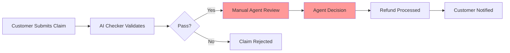
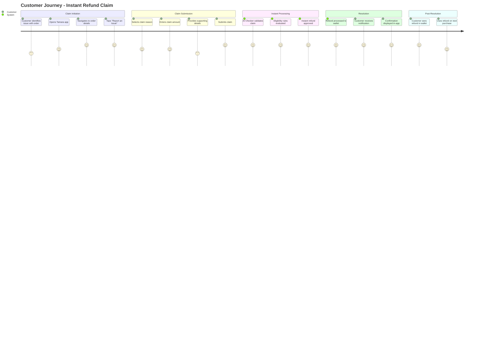
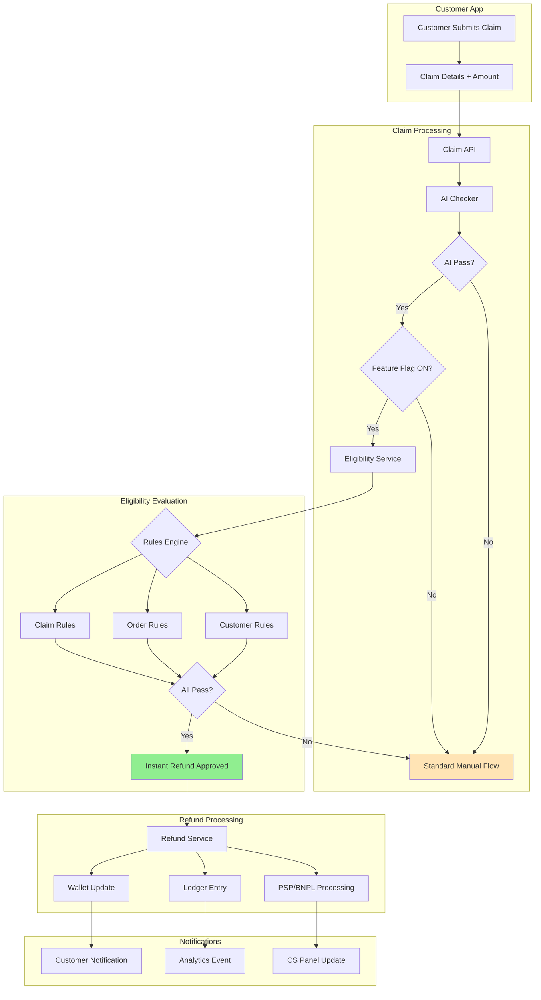
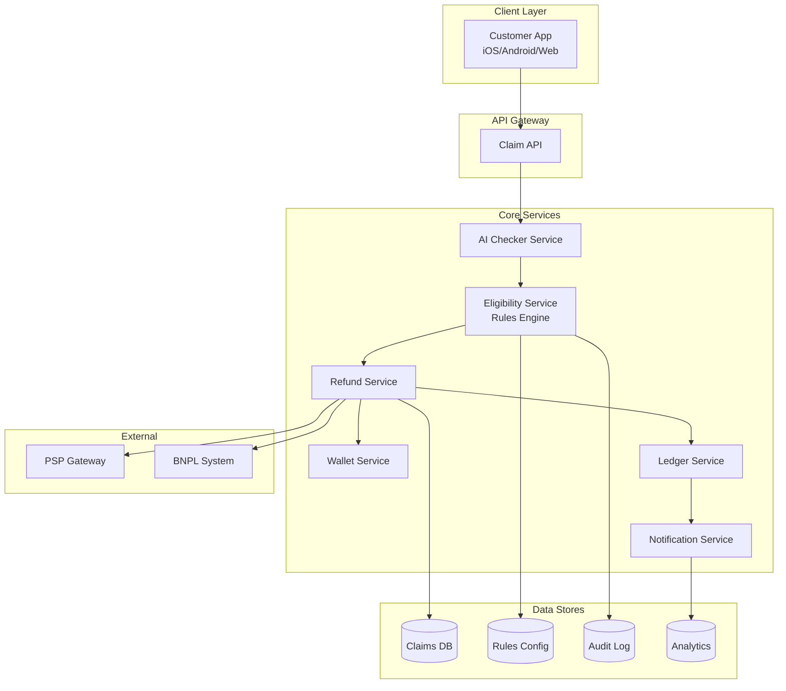
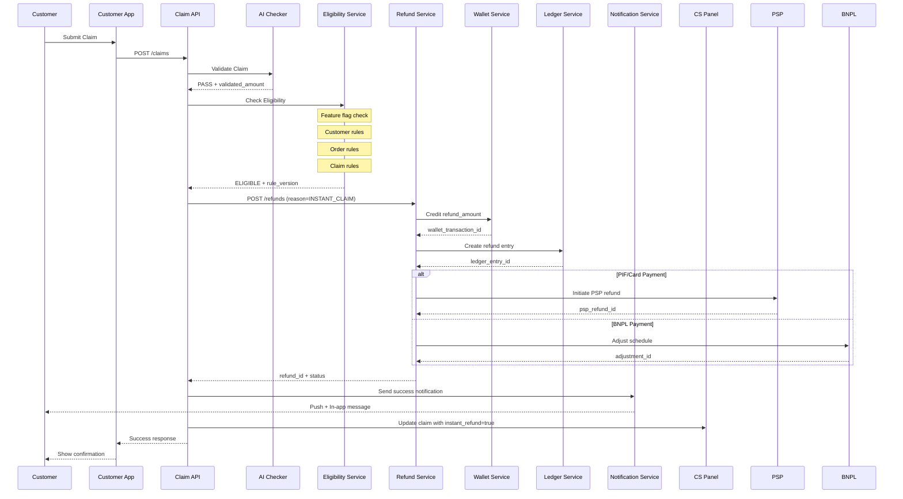
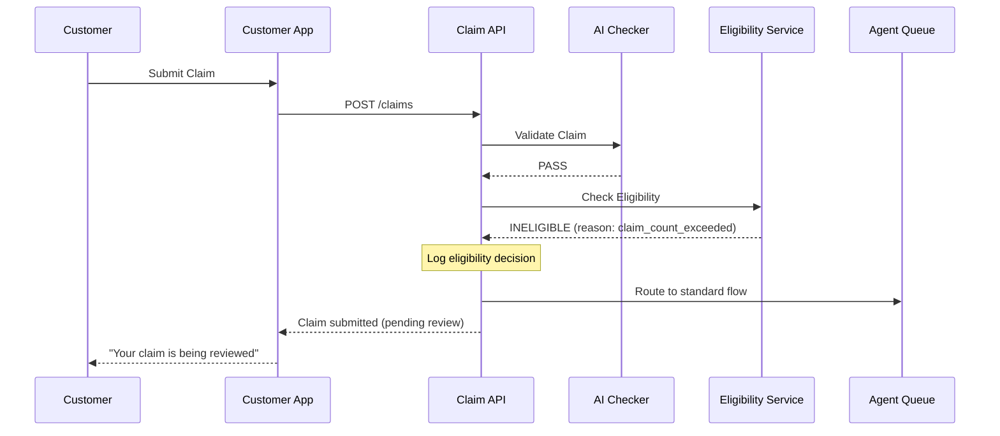
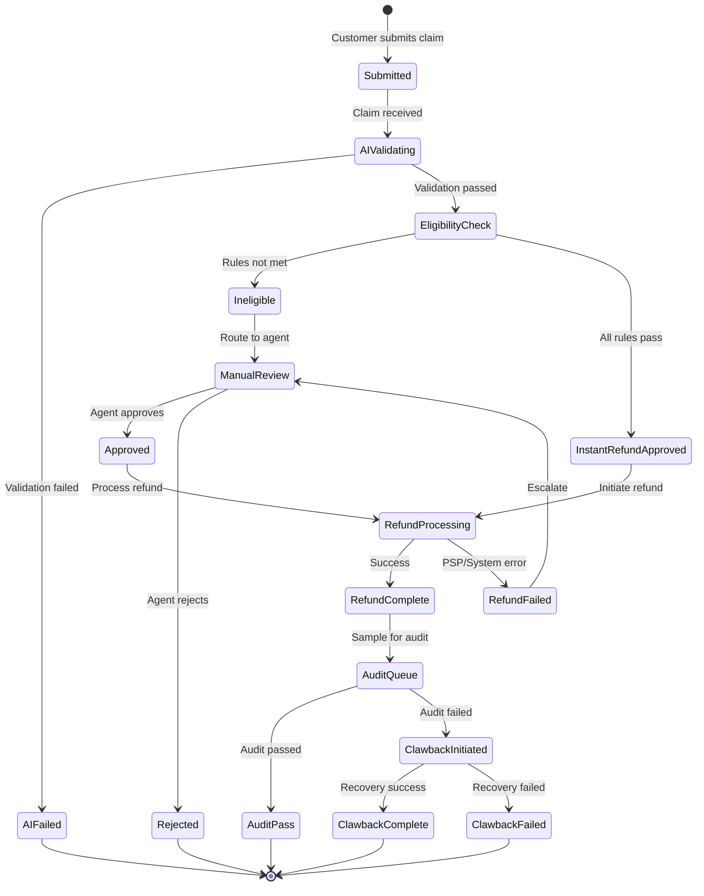
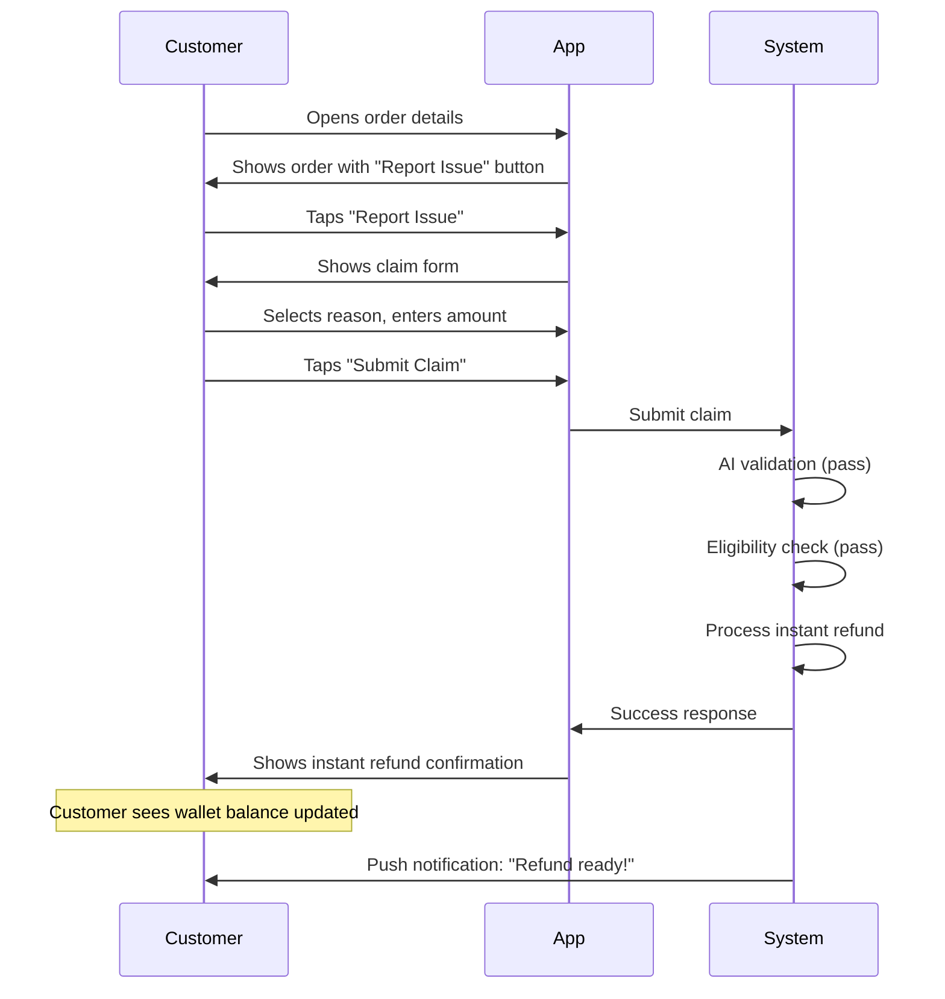
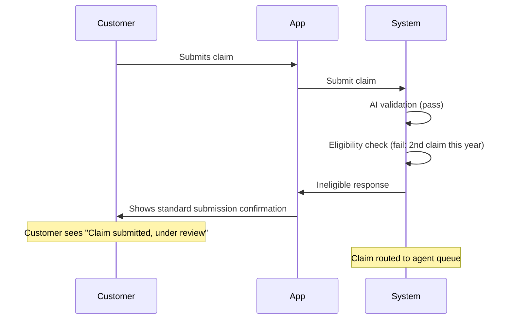
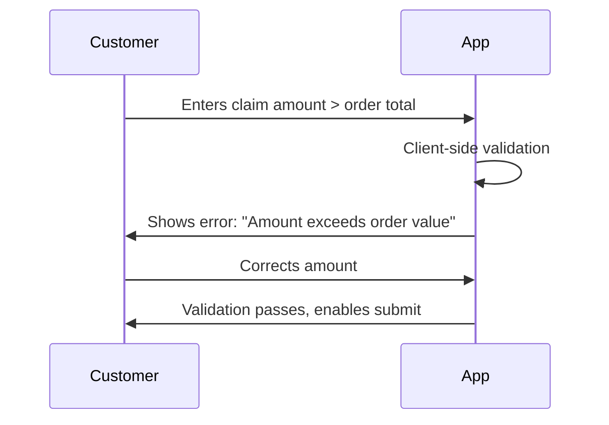

# PRD: Instant Refunds for Buyer Protection Claims

> 📋 **This PRD defines the requirements for enabling instant refunds for pre-qualified customers submitting claims in-app, leveraging existing dispute management infrastructure and AI claim validation.**

---

**Version:** 1.0 | **Status:** Draft | **Created:** March 3, 2026 | **Target Launch:** TBD

---

## 📑 Table of Contents

<details>
<summary><strong>1. Executive Summary</strong></summary>

### 📌 Introduction

Instant Refunds enables a pre-qualified segment of customers to receive immediate refunds after submitting a claim in-app. The feature is contingent on:
1. Passing the AI claim submission checker
2. Meeting configurable eligibility rules

The immediate goal is to reduce customer effort and time-to-resolution (TTR) while keeping fraud and leakage within defined guardrails.

**Key Principle:** This feature builds on top of the **existing dispute management flows and infrastructure**, including the current claim submission process, AI validation, and refund processing systems. No new core systems are being built—we are adding an "instant" decisioning layer.

**Phased Approach:**
- **Phase 1:** Rules-based eligibility engine (this release)
- **Phase 2:** Enhanced rules with merchant controls
- **Phase 3:** ML-driven eligibility scoring
- **Phase 4:** Full AI decisioning with policy optimization

</details>

---

<details>
<summary><strong>2. Problem Statement</strong></summary>

### ❗ Problem Statement

Today, all claims wait for manual review (either by claim Agents or the merchant) before refund, resulting in:

| Problem | Impact |
|---------|--------|
| **Long Resolution Times** | Avoidable repeat contacts, low CSAT, increased "where is my refund?" inquiries |
| **High Operational Load** | Claim agents spend time on straightforward, low-risk cases that could be auto-resolved |
| **Opportunity Cost** | Safe cases are treated the same as risky ones, missing efficiency gains |
| **Customer Frustration** | Customers with legitimate claims must wait days for resolution |
| **Repeat Contacts** | Customers contact support multiple times to check claim status |

### Current State Flow



**Pain Point:** The red boxes represent the bottleneck—manual review adds days to resolution time for even the simplest, lowest-risk claims.

### Quantitative Impact (Estimated)

| Metric | Current State | Target State |
|--------|---------------|--------------|
| Average claim resolution time | 2-5 days | < 30 seconds (for eligible) |
| Repeat contacts per claim | ~1.8 | < 1.2 |
| Agent time on low-risk claims | ~40% of workload | < 15% |
| Customer satisfaction (fSAT) | Baseline | +10 points |

</details>

---

<details>
<summary><strong>3. Goals & Success Metrics</strong></summary>

### 🎯 Goals

| # | Goal | Description |
|---|------|-------------|
| 1 | **Reduce Resolution Time** | For eligible claims, reduce resolution from days → seconds |
| 2 | **Lower Contacts Per Claim** | Pre-empt "where is my refund?" follow-ups through instant resolution |
| 3 | **Maintain Fraud Controls** | Keep fraud loss and leakage within defined guardrails |
| 4 | **Reduce Agent Workload** | Free agents to focus on complex, high-risk cases |

### 📊 Success Metrics

#### Primary Metrics

| Metric | Target | Measurement |
|--------|--------|-------------|
| **Refund Amount Accuracy** | ≥ 95% of instant refunds within acceptable variance | Compare instant refund amount vs. what agent would have approved |
| **fSAT (Claims)** | +10 points vs. non-instant refunds | Post-claim satisfaction survey |
| **Instant Refund Success Rate** | ≥ 99% within 30 seconds | System monitoring |

#### Secondary Metrics

| Metric | Target | Measurement |
|--------|--------|-------------|
| Repeat contact rate reduction | 30% decrease | Support ticket analysis |
| Agent workload on low-risk claims | 50% reduction | Agent time tracking |
| Fraud/leakage rate | ≤ Budget L | Clawback and audit analysis |
| Customer effort score | 20% improvement | CES surveys |

</details>

---

<details>
<summary><strong>4. User Personas & Journeys</strong></summary>

### 👤 User Personas

#### Paying Member (Smart/PIF Customer)

**Profile:** Pre-qualified customer with buyer protection eligibility (Smart member OR Pay-in-Full payment type)

**Needs:**
- Quick resolution when something goes wrong with an order
- Transparent process with clear communication
- Trust that Tamara has their back

**Pain Points:**
- Waiting days for refund on legitimate claims
- Having to explain the same issue multiple times
- Uncertainty about claim status

---

#### Customer Care Agent

**Profile:** Support agent handling claims and disputes

**Needs:**
- Focus time on complex cases requiring judgment
- Clear visibility into instant refund decisions
- Ability to override or adjust when needed

**Pain Points:**
- Processing high volume of straightforward claims
- Repetitive work on low-risk cases
- Customer frustration during wait times

---

#### Fraud/Finance Stakeholder

**Profile:** Risk management and finance team members

**Needs:**
- Visibility into exposure and recovery rates
- Accurate ledger entries and reconciliation
- Configurable controls to manage risk

**Pain Points:**
- Balancing customer experience with fraud prevention
- Manual audit of refund decisions
- Lack of real-time exposure monitoring

---

### Customer Journey: Instant Refund Flow



</details>

---

<details>
<summary><strong>5. Solution Overview</strong></summary>

### 💡 Solution Overview

When a customer submits a claim in-app:



### Key Decision Points

| Step | Decision | Outcome if Pass | Outcome if Fail |
|------|----------|-----------------|-----------------|
| AI Checker | Claim completeness & validity | Proceed to eligibility | Standard manual flow |
| Feature Flag | Instant Refunds enabled | Proceed to rules | Standard manual flow |
| Customer Rules | Smart/PIF, claim history, chargebacks | Proceed | Standard manual flow |
| Order Rules | Amount caps, payment method | Proceed | Standard manual flow |
| Claim Rules | Allowed reasons | Instant refund | Standard manual flow |

### Integration with Existing Infrastructure

**This solution leverages existing systems:**

| Component | Existing System | Enhancement |
|-----------|-----------------|-------------|
| Claim Submission | Current in-app claim flow | Add instant refund check |
| AI Validation | Existing AI Checker | No changes |
| Refund Processing | Current Refund Service | Add `INSTANT_CLAIM` reason |
| Wallet | Existing Wallet Service | No changes |
| Ledger | Current Ledger Service | Support provisional entries |
| Notifications | Existing Notification Service | New templates |
| CS Panel | Current Agent Workspace | Add instant refund visibility |

</details>

---

<details>
<summary><strong>6. Detailed Solution Design</strong></summary>

### 📐 Solution Design (System)

#### High-Level Architecture



#### Sequence Diagram: Instant Refund Happy Path



#### Sequence Diagram: Ineligible Flow (Fallback)



#### State Machine: Claim with Instant Refund



</details>

---

<details>
<summary><strong>7. Functional Requirements</strong></summary>

### 🧩 Functional Requirements

#### 7.1 Claim Amount Validation (Blocking)

| Requirement | Description | Error Handling |
|-------------|-------------|----------------|
| **Required Field** | Amount must be provided, numeric, > 0 | Block with error: "Please enter a valid amount" |
| **Order Total Cap** | Amount ≤ order_total (or ≤ remaining if partial refund exists) | Block with error: "Amount exceeds order value" |
| **Currency Match** | Currency must equal order currency | Block with error: "Currency mismatch" |
| **Minor Units** | Enforce correct minor units and rounding | Auto-correct or block |
| **Multi-Item** | Sum of selected items ≤ order_total | Block with error: "Selected items exceed order total" |

#### 7.2 Eligibility Rules Engine (Phase 1)

All rules are **AND** unless stated otherwise. Each is configurable in CS Panel.

##### Global Flags

| Flag | Description | Default |
|------|-------------|---------|
| `instant_refund_feature_on` | Master feature toggle | OFF |
| `ai_checker_gate_on` | Require AI checker pass | ON |
| `pilot_markets` | List of enabled markets | [] |

##### Customer-Level Rules

| Rule | Condition | Default |
|------|-----------|---------|
| Buyer Protection Cohort | `is_smart_member = true` **OR** `order_payment_type = PIF` | ON |
| Claim History | `claims_count_last_365d ≤ N1` | N1 = 1 |
| Chargeback History | `chargebacks_last_180d = 0` | ON |

##### Order-Level Rules

| Rule | Condition | Default |
|------|-----------|---------|
| Amount Cap | `order_amount ≤ CAP1` (per market) | OFF until simulation |
| Payment Method | `payment_method ∈ allowed_methods` | [PIF, CARD, WALLET] |
| Order Age | `order_age_days ≤ D1` | D1 = 14 |

##### Claim-Level Rules

| Rule | Condition | Default |
|------|-----------|---------|
| Allowed Reasons | `claim_reason ∈ allowed_reasons` | ["ITEM_NOT_RECEIVED", "DUPLICATE_CHARGE"] |
| Merchant Tier | `merchant_tier ∈ allowed_tiers` | ["LOW", "MEDIUM"] |

#### 7.3 Refund Amount Determination

```
refund_amount = min(validated_claim_amount, CAP1)
```

Where:
- `validated_claim_amount` = Amount validated by AI Checker
- `CAP1` = Market-specific cap (if enabled)

#### 7.4 Posting & Reconciliation

| Payment Type | Action |
|--------------|--------|
| **PIF/Card** | Send PSP refund immediately; store acquirer/refund_id |
| **BNPL/Schedule** | Adjust outstanding schedule; post to wallet if needed |

**Ledger Entries:**
- Create `refund_provisional` entry
- Convert to `refund_finalized` after settlement
- Support `clawback` journal if later reversed

#### 7.5 Clawback & Controls

| Control | Configuration |
|---------|---------------|
| **Clawback Window** | Configurable (default: 14 days) |
| **Clawback Triggers** | Merchant proves fulfillment, fraud signals, agent audit |
| **Clawback Method** | Reverse wallet entry / recharge card / collect in next installment |
| **Rate Limits** | Per-user daily/weekly caps |
| **Circuit Breaker** | System-wide halt if anomaly detected |
| **Audit Sampling** | Configurable `sample_rate` per rule |

</details>

---

<details>
<summary><strong>8. User Experience & Interactions</strong></summary>

### 🎨 User Experience Design

#### 8.1 Customer In-App Experience

##### Claim Submission Screen

```
┌─────────────────────────────────────┐
│  ← Report an Issue                  │
├─────────────────────────────────────┤
│                                     │
│  Order #12345                       │
│  Merchant Name • SAR 500.00         │
│                                     │
│  ─────────────────────────────────  │
│                                     │
│  What's the issue?                  │
│  ┌─────────────────────────────┐   │
│  │ Item not received        ▼ │   │
│  └─────────────────────────────┘   │
│                                     │
│  Refund amount                      │
│  ┌─────────────────────────────┐   │
│  │ SAR 500.00                   │   │
│  └─────────────────────────────┘   │
│  ⓘ Enter the amount you'd like     │
│    refunded                         │
│                                     │
│  Additional details (optional)      │
│  ┌─────────────────────────────┐   │
│  │                             │   │
│  │                             │   │
│  └─────────────────────────────┘   │
│                                     │
│  ┌─────────────────────────────┐   │
│  │      Submit Claim           │   │
│  └─────────────────────────────┘   │
│                                     │
└─────────────────────────────────────┘
```

##### Instant Refund Success Screen

```
┌─────────────────────────────────────┐
│                                     │
│              ✓                      │
│                                     │
│     Refund Issued Instantly         │
│                                     │
│     SAR 500.00                      │
│     has been added to your          │
│     Tamara Wallet                   │
│                                     │
│  ─────────────────────────────────  │
│                                     │
│  Use your wallet balance on your    │
│  next purchase with Tamara.         │
│                                     │
│  ┌─────────────────────────────┐   │
│  │      View Wallet            │   │
│  └─────────────────────────────┘   │
│                                     │
│  ┌─────────────────────────────┐   │
│  │      Back to Orders         │   │
│  └─────────────────────────────┘   │
│                                     │
└─────────────────────────────────────┘
```

##### Standard Flow (Non-Instant) Screen

```
┌─────────────────────────────────────┐
│                                     │
│              📋                     │
│                                     │
│     Claim Submitted                 │
│                                     │
│     We're reviewing your claim      │
│     for SAR 500.00                  │
│                                     │
│  ─────────────────────────────────  │
│                                     │
│  Expected resolution: 2-3 days      │
│                                     │
│  We'll notify you when there's      │
│  an update.                         │
│                                     │
│  ┌─────────────────────────────┐   │
│  │      Track Claim            │   │
│  └─────────────────────────────┘   │
│                                     │
└─────────────────────────────────────┘
```

#### 8.2 Customer Communication Copy

| Scenario | Message |
|----------|---------|
| **Instant Refund Success** | "We've issued your instant refund of SAR {amount}, which you can use on your next purchase with Tamara. The amount has been added to your Tamara Wallet." |
| **Standard Flow (Ineligible)** | "Your claim has been submitted and is being reviewed. We'll notify you when there's an update." |
| **Clawback Notification** | "We've reversed a refund of SAR {amount} from {date} because {reason}. If you disagree, please contact support with evidence." |
| **Push Notification (Success)** | "Good news! Your refund of SAR {amount} is ready in your Tamara Wallet 💰" |

#### 8.3 CS Panel / Agent Experience

##### Claim Detail View (with Instant Refund)

```
┌─────────────────────────────────────────────────────────────┐
│  Claim #CLM-789456                                          │
├─────────────────────────────────────────────────────────────┤
│                                                             │
│  Status: ✅ Instant Refund Issued                           │
│                                                             │
│  ┌─────────────────────────────────────────────────────┐   │
│  │ INSTANT REFUND DETAILS                              │   │
│  ├─────────────────────────────────────────────────────┤   │
│  │ Eligibility Decision: APPROVED                      │   │
│  │ Rule Version: v1.2.3                                │   │
│  │ Decision Time: 2026-03-03 14:32:05 UTC              │   │
│  │ Refund ID: REF-123456                               │   │
│  │ Amount: SAR 500.00                                  │   │
│  │                                                     │   │
│  │ Eligibility Criteria Met:                           │   │
│  │ ✓ Smart Member                                      │   │
│  │ ✓ First claim in 365 days                          │   │
│  │ ✓ No chargebacks                                   │   │
│  │ ✓ Order amount within cap                          │   │
│  │ ✓ Allowed claim reason                             │   │
│  └─────────────────────────────────────────────────────┘   │
│                                                             │
│  Customer: John Doe (C-12345)                               │
│  Order: #ORD-789012 • SAR 500.00                           │
│  Merchant: Example Store                                    │
│  Claim Reason: Item not received                            │
│                                                             │
│  ┌──────────────┐  ┌──────────────┐                        │
│  │ Flag for     │  │ Initiate     │                        │
│  │ Audit        │  │ Clawback     │                        │
│  └──────────────┘  └──────────────┘                        │
│                                                             │
└─────────────────────────────────────────────────────────────┘
```

#### 8.4 Interaction Flows

##### Flow 1: Eligible Customer - Happy Path



##### Flow 2: Ineligible Customer - Graceful Fallback



##### Flow 3: Amount Validation Error



</details>

---

<details>
<summary><strong>9. Admin & Configuration</strong></summary>

### 🛠 Admin / CS Panel Configuration

#### New Config Screen: Instant Refunds

```
┌─────────────────────────────────────────────────────────────┐
│  ⚙️ Instant Refunds Configuration                           │
├─────────────────────────────────────────────────────────────┤
│                                                             │
│  GLOBAL SETTINGS                                            │
│  ─────────────────────────────────────────────────────────  │
│  Master Toggle          [ON] ○───────●                      │
│  AI Checker Required    [ON] ○───────●                      │
│                                                             │
│  PILOT MARKETS                                              │
│  ─────────────────────────────────────────────────────────  │
│  ☑ Saudi Arabia (SA)                                       │
│  ☑ United Arab Emirates (AE)                               │
│  ☐ Kuwait (KW)                                             │
│                                                             │
│  ELIGIBILITY THRESHOLDS                                     │
│  ─────────────────────────────────────────────────────────  │
│  Max claims per user (N1)     [  1  ] per 365 days         │
│  Max order age (D1)           [ 14  ] days                 │
│  Max refund amount (CAP1)                                   │
│    SA: SAR [ 200 ]                                         │
│    AE: AED [ 200 ]                                         │
│                                                             │
│  ALLOWED REASONS                                            │
│  ─────────────────────────────────────────────────────────  │
│  ☑ Item not received                                       │
│  ☑ Duplicate charge                                        │
│  ☐ Wrong item received                                     │
│  ☐ Item damaged                                            │
│                                                             │
│  PAYMENT METHODS                                            │
│  ─────────────────────────────────────────────────────────  │
│  ☑ Pay in Full (PIF)                                       │
│  ☑ Card                                                    │
│  ☑ Wallet                                                  │
│  ☐ BNPL                                                    │
│                                                             │
│  MERCHANT TIERS                                             │
│  ─────────────────────────────────────────────────────────  │
│  ☑ Low Risk                                                │
│  ☑ Medium Risk                                             │
│  ☐ High Risk                                               │
│                                                             │
│  CLAWBACK SETTINGS                                          │
│  ─────────────────────────────────────────────────────────  │
│  Clawback Enabled       [ON] ○───────●                      │
│  Clawback Window        [ 14 ] days                        │
│  Triggers:                                                  │
│    ☑ Merchant proof of fulfillment                         │
│    ☑ Fraud signal detected                                 │
│    ☑ Audit failure                                         │
│                                                             │
│  OVERRIDES                                                  │
│  ─────────────────────────────────────────────────────────  │
│  User Blocklist: [ Add user ID... ]                        │
│                                                             │
│  ┌──────────────┐  ┌──────────────┐                        │
│  │    Save      │  │   Cancel     │                        │
│  └──────────────┘  └──────────────┘                        │
│                                                             │
└─────────────────────────────────────────────────────────────┘
```

#### Monitoring Dashboard

| Panel | Metrics |
|-------|---------|
| **Live Counters** | Attempts, Grants, Failures (by reason) |
| **Exposure** | Total instant refund value (rolling 24h, 7d, 30d) |
| **Circuit Breaker** | Status, trigger history |
| **Eligibility Funnel** | Pass/fail rates at each rule |
| **Anomaly Alerts** | Grant rate deviation (±3σ) |

</details>

---

<details>
<summary><strong>10. Technical Specifications</strong></summary>

### ⚙️ Technical Specifications

#### 10.1 API Contracts

##### POST /claims (Enhanced)

```json
{
  "order_id": "ORD-789012",
  "claim_reason": "ITEM_NOT_RECEIVED",
  "claim_amount": {
    "amount": 50000,
    "currency": "SAR"
  },
  "description": "Item never arrived",
  "evidence": ["attachment_id_1", "attachment_id_2"]
}
```

**Response (Instant Refund Approved):**

```json
{
  "claim_id": "CLM-789456",
  "status": "INSTANT_REFUND_ISSUED",
  "instant_refund": {
    "granted": true,
    "refund_id": "REF-123456",
    "amount": {
      "amount": 50000,
      "currency": "SAR"
    },
    "wallet_transaction_id": "WTX-789",
    "eligibility_rule_version": "v1.2.3",
    "decision_timestamp": "2026-03-03T14:32:05Z"
  }
}
```

**Response (Ineligible):**

```json
{
  "claim_id": "CLM-789457",
  "status": "PENDING_REVIEW",
  "instant_refund": {
    "granted": false,
    "eligibility_reason": "CLAIM_COUNT_EXCEEDED",
    "eligibility_rule_version": "v1.2.3"
  }
}
```

##### POST /claims/{id}/instant-refund-check (Internal)

```json
{
  "claim_id": "CLM-789456",
  "customer_id": "C-12345",
  "order_id": "ORD-789012",
  "claim_amount": 50000,
  "claim_reason": "ITEM_NOT_RECEIVED"
}
```

**Response:**

```json
{
  "eligible": true,
  "rule_version": "v1.2.3",
  "rules_evaluated": [
    {"rule": "smart_member", "passed": true},
    {"rule": "claim_count", "passed": true, "value": 0, "threshold": 1},
    {"rule": "chargeback_count", "passed": true, "value": 0},
    {"rule": "order_amount_cap", "passed": true, "value": 500, "threshold": 200},
    {"rule": "claim_reason", "passed": true}
  ],
  "idempotency_key": "ir-CLM-789456-v1"
}
```

#### 10.2 Database Schema Changes

##### Claims Table (New Fields)

| Field | Type | Description |
|-------|------|-------------|
| `instant_refund_attempted` | BOOLEAN | Whether instant refund was evaluated |
| `instant_refund_granted` | BOOLEAN | Whether instant refund was approved |
| `eligibility_reason` | STRING | Reason for eligibility decision |
| `eligibility_rule_version` | STRING | Version of rules used |
| `refund_amount_minor` | INTEGER | Refund amount in minor units |
| `validation_errors` | JSON | Any validation errors encountered |

##### New Table: Eligibility Rule Versions

```sql
CREATE TABLE eligibility_rule_versions (
  id UUID PRIMARY KEY,
  version STRING NOT NULL,
  config JSON NOT NULL,
  created_at TIMESTAMP NOT NULL,
  created_by STRING NOT NULL,
  is_active BOOLEAN DEFAULT false
);
```

##### New Table: Instant Refund Audit Log

```sql
CREATE TABLE instant_refund_audit_log (
  id UUID PRIMARY KEY,
  claim_id UUID NOT NULL,
  customer_id STRING NOT NULL,
  order_id STRING NOT NULL,
  decision STRING NOT NULL,
  rule_version STRING NOT NULL,
  rules_snapshot JSON NOT NULL,
  refund_amount_minor INTEGER,
  created_at TIMESTAMP NOT NULL,
  audit_status STRING DEFAULT 'PENDING',
  audited_at TIMESTAMP,
  audited_by STRING,
  audit_result STRING
);
```

#### 10.3 Events (Observability/Audit)

| Event | Description | Payload |
|-------|-------------|---------|
| `claim.submitted` | Claim created | claim_id, customer_id, order_id, amount |
| `ai_checker.passed` | AI validation passed | claim_id, confidence_score |
| `ai_checker.failed` | AI validation failed | claim_id, failure_reason |
| `instant_refund.eligible` | Passed eligibility | claim_id, rule_version, rules_passed |
| `instant_refund.ineligible` | Failed eligibility | claim_id, rule_version, failure_reason |
| `refund.initiated` | Refund processing started | refund_id, claim_id, amount |
| `refund.succeeded` | Refund completed | refund_id, psp_reference |
| `refund.failed` | Refund failed | refund_id, error_code |
| `clawback.initiated` | Clawback started | claim_id, refund_id, reason |
| `clawback.succeeded` | Clawback completed | claim_id, recovered_amount |
| `clawback.failed` | Clawback failed | claim_id, error_reason |
| `audit.flagged` | Claim flagged for audit | claim_id, flag_reason |

</details>

---

<details>
<summary><strong>11. Inclusions & Exclusions</strong></summary>

### ✅ Inclusions & Exclusions

#### Phase 1 Inclusions

| Category | Items |
|----------|-------|
| **Eligibility** | Buyer protection cohorts (Smart OR PIF) |
| **Markets** | Pilot markets (SA, AE) |
| **Claim Reasons** | Item not received, Duplicate charge |
| **Payment Methods** | PIF, Card, Wallet |
| **Features** | Rules engine, CS Panel config, PSP/BNPL posting, Basic audit queue, Dashboards |
| **Controls** | Amount caps, Claim history limits, Clawback primitives |

#### Phase 1 Exclusions

| Category | Items | Reason |
|----------|-------|--------|
| **Merchants** | High-risk merchants | Higher fraud risk |
| **Orders** | Cross-border FX | Complexity |
| **Orders** | Orders older than D1 days | Higher dispute rate |
| **Features** | ML-based scoring | Phase 3 |
| **Features** | Personalized caps | Phase 3 |
| **Features** | Automated clawback flows | Phase 2 |

</details>

---

<details>
<summary><strong>12. Rollout Plan</strong></summary>

### 🚀 Roll-out Plan (Phased)

#### Phase 1 — Rules MVP (This Release)

| Week | Activities |
|------|------------|
| 1-2 | Implement claim amount validation, Eligibility service skeleton |
| 3-4 | Rules engine implementation, CS Panel config UI |
| 5-6 | Refund service integration, PSP/BNPL posting |
| 7-8 | Audit queue, Dashboards, Testing |
| 9-10 | Pilot rollout (5% → 25% → 50% → 100%) |

**Pilot Scope:**
- Markets: SA, AE
- Cohorts: Smart members, PIF customers
- Caps: Conservative (SAR/AED 200)

#### Phase 2 — Smarter Rules & Merchant Controls

- Per-merchant caps and history-based allowlists
- Simple risk score (rule-based) using delivery confirmations, device/account age
- Automated clawback flows

#### Phase 3 — ML Eligibility Scoring

- Real-time model predicting claim validity probability
- Threshold tuned to budgeted leakage
- Personalization: dynamic per-user caps, adaptive audit sampling

#### Phase 4 — Full AI Decisioning & Policy Optimization

- Contextual bandits or reinforcement learning
- Optimize CSAT-adjusted cost function
- End-to-end automation for low-risk paths
- Human-in-the-loop only for ambiguous cases

#### Rollout Gates

| Gate | Criteria |
|------|----------|
| **Pilot Start** | All P0 features complete, QA sign-off |
| **25% Rollout** | < 1% error rate, < 2s latency P95 |
| **50% Rollout** | Fraud rate within budget, positive CSAT signal |
| **100% Rollout** | All metrics green for 7 days |

#### Rollback Criteria

- Error rate > 1%
- Fraud/leakage rate > 2x budget
- PSP refund failure rate > 5%
- Customer complaints spike

</details>

---

<details>
<summary><strong>13. Experiment & Monitoring</strong></summary>

### 🧪 Experiment & Monitoring

#### A/B Test Design

| Parameter | Value |
|-----------|-------|
| **Test Type** | Holdout by userId |
| **Initial Traffic** | 5-10% eligible traffic |
| **Ramp Schedule** | 5% → 25% → 50% → 100% |
| **Control Group** | Standard manual flow |
| **Treatment Group** | Instant refund flow |

#### Dashboards

| Dashboard | Metrics |
|-----------|---------|
| **Eligibility Funnel** | Pass/fail rates at each rule, Reasons for ineligibility |
| **Refund Performance** | Grant rate, Latency (P50/P95/P99), Success rate |
| **Financial Exposure** | Total instant refund value, Recovery rate, Net leakage |
| **Customer Impact** | fSAT delta, Repeat contact rate, Resolution time |
| **Fraud Signals** | Clawback rate, Audit failure rate, Anomaly flags |

#### Alerts

| Alert | Threshold | Action |
|-------|-----------|--------|
| Grant rate anomaly | ±3σ from baseline | Page on-call |
| PSP refund failure spike | > 5% in 15 min | Page on-call |
| Exposure exceeding budget | > 80% of daily budget | Notify finance |
| Circuit breaker triggered | Any trigger | Page on-call |

</details>

---

<details>
<summary><strong>14. Risk, Legal & Compliance</strong></summary>

### 🔒 Risk, Legal, Compliance

#### Risk Mitigation

| Risk | Mitigation |
|------|------------|
| **Fraud Abuse** | Conservative caps, Claim history limits, Clawback capability |
| **System Failure** | Graceful fallback to manual flow, Circuit breaker |
| **Financial Exposure** | Daily budget limits, Real-time monitoring |
| **Customer Confusion** | Clear communication, Consistent UX |

#### Legal & Compliance

| Requirement | Action |
|-------------|--------|
| **Policy Disclosure** | Publish Instant Refunds policy in Help Center |
| **Provisional Nature** | Disclose clawback possibility if enabled |
| **PSP Compliance** | Ensure refund reversals comply with scheme/network rules |
| **Local Regulations** | Verify compliance with SA/AE consumer protection laws |
| **Data Retention** | Audit logs retained per data retention policy |
| **Access Controls** | Role-based access for claim evidence |

</details>

---

<details>
<summary><strong>15. Acceptance Criteria</strong></summary>

### 🧰 Acceptance Criteria (Phase 1)

| # | Criteria |
|---|----------|
| 1 | Given feature flag ON, AI checker PASS, and rules satisfied → refund ≥ 99% success rate within 30s |
| 2 | Claim blocked if claim_amount > order_total with clear error message |
| 3 | Claim blocked if invalid currency/minor units with clear error message |
| 4 | Rule changes are versioned; each decision logs rule_version and reason |
| 5 | CS Panel displays eligibility decision and refund_id within claim view |
| 6 | Ineligible claims route to standard manual flow without error |
| 7 | Clawback can be initiated from CS Panel with audit trail |
| 8 | All events published to analytics pipeline |
| 9 | Dashboard shows real-time eligibility funnel and exposure |
| 10 | Circuit breaker halts instant refunds if anomaly detected |

</details>

---

<details>
<summary><strong>16. Data Team Requests</strong></summary>

### 📊 Data Team Requests

#### Request A — Claim Amount Variance Audit

**Goal:** Measure how often and by how much agents change customer-entered claim amounts.

**Population:** All in-app claims over the last 12 months (exclude test/sandbox). Provide by market and payment type.

**Outputs:**

| Output | Description |
|--------|-------------|
| % claims with amount changed | Any change by agent |
| Directionality | Increases vs. decreases |
| Breakdowns | By claim reason, merchant tier, payment method, cohort, order_amount buckets, order_age buckets, customer trust deciles |
| Agent cycle time | How many required second touch |

**Suggested Fields:**
- `claim_id`, `order_id`, `user_id`, `market`, `merchant_id`
- `claim_reason`, `order_amount`, `order_currency`
- `entered_claim_amount`, `agent_final_amount`
- `created_at`, `agent_decided_at`
- `payment_method`, `membership_tier`, `merchant_risk_tier`
- `user_trust_score`, `prior_claims_365d`, `chargebacks_180d`

**Deliverables:**
- Summary table with metrics per breakdown
- Time series (weekly) of change-rate

---

#### Request B — Instant Refund Simulations ✅ Completed

**Goal:** Estimate volume, refund value, and loss exposure under multiple eligibility scenarios.

**Population:** 655,782 disputes in SA + AE over the last 12 months (Mar 2025 – Mar 2026).
**Fixed rule applied to all scenarios:** Customer has zero chargebacks in last 180 days.

**Three configurable levers tested:**
- **Max order amount:** 200, 500, 1,000 SAR/AED
- **Max refunds per customer per year:** 1, 2, or 3 times
- **Order age at time of dispute:** Within 14, 30, or 120 days

---

##### Buyer Protection Cohort (Recommended) — Smart members OR PIF customers

**Orders placed within the last 14 days:**

| Max order amount | 1 refund/customer/year | 2 refunds/customer/year | 3 refunds/customer/year |
|:---|---:|---:|---:|
| **200 SAR/AED** | **404K** — 3,390 disputes | **517K** — 4,351 disputes | **560K** — 4,711 disputes |
| **500 SAR/AED** | **1.5M** — 6,673 disputes | **1.9M** — 8,604 disputes | **2.1M** — 9,310 disputes |
| **1,000 SAR/AED** | **3.0M** — 8,758 disputes | **3.9M** — 11,285 disputes | **4.2M** — 12,207 disputes |

**Orders placed within the last 30 days:**

| Max order amount | 1 refund/customer/year | 2 refunds/customer/year | 3 refunds/customer/year |
|:---|---:|---:|---:|
| **200 SAR/AED** | **463K** — 3,872 disputes | **596K** — 4,992 disputes | **649K** — 5,436 disputes |
| **500 SAR/AED** | **1.7M** — 7,697 disputes | **2.2M** — 9,988 disputes | **2.4M** — 10,879 disputes |
| **1,000 SAR/AED** | **3.5M** — 10,163 disputes | **4.5M** — 13,174 disputes | **4.9M** — 14,358 disputes |

**Orders placed within the last 120 days:**

| Max order amount | 1 refund/customer/year | 2 refunds/customer/year | 3 refunds/customer/year |
|:---|---:|---:|---:|
| **200 SAR/AED** | **544K** — 4,524 disputes | **704K** — 5,855 disputes | **767K** — 6,383 disputes |
| **500 SAR/AED** | **2.0M** — 9,050 disputes | **2.7M** — 11,797 disputes | **2.9M** — 12,907 disputes |
| **1,000 SAR/AED** | **4.1M** — 11,983 disputes | **5.4M** — 15,585 disputes | **5.9M** — 17,058 disputes |

---

##### PIF Only Cohort — Pay-in-Full customers

**Orders placed within the last 14 days:**

| Max order amount | 1 refund/customer/year | 2 refunds/customer/year | 3 refunds/customer/year |
|:---|---:|---:|---:|
| **200 SAR/AED** | **219K** — 1,877 disputes | **280K** — 2,394 disputes | **302K** — 2,586 disputes |
| **500 SAR/AED** | **825K** — 3,737 disputes | **1.1M** — 4,797 disputes | **1.2M** — 5,200 disputes |
| **1,000 SAR/AED** | **1.5M** — 4,698 disputes | **1.9M** — 6,030 disputes | **2.1M** — 6,535 disputes |

**Orders placed within the last 30 days:**

| Max order amount | 1 refund/customer/year | 2 refunds/customer/year | 3 refunds/customer/year |
|:---|---:|---:|---:|
| **200 SAR/AED** | **247K** — 2,100 disputes | **320K** — 2,709 disputes | **350K** — 2,964 disputes |
| **500 SAR/AED** | **951K** — 4,257 disputes | **1.2M** — 5,531 disputes | **1.4M** — 6,061 disputes |
| **1,000 SAR/AED** | **1.8M** — 5,383 disputes | **2.3M** — 6,981 disputes | **2.5M** — 7,650 disputes |

**Orders placed within the last 120 days:**

| Max order amount | 1 refund/customer/year | 2 refunds/customer/year | 3 refunds/customer/year |
|:---|---:|---:|---:|
| **200 SAR/AED** | **273K** — 2,294 disputes | **358K** — 2,999 disputes | **394K** — 3,297 disputes |
| **500 SAR/AED** | **1.1M** — 4,734 disputes | **1.4M** — 6,237 disputes | **1.6M** — 6,891 disputes |
| **1,000 SAR/AED** | **2.0M** — 6,029 disputes | **2.6M** — 7,917 disputes | **2.9M** — 8,747 disputes |

---

##### Recommended Starting Configuration

| Setting | Value | Rationale |
|:---|:---|:---|
| **Customer group** | Buyer Protection (Smart + PIF) | Highest-trust segment, smallest blast radius |
| **Max order amount** | 1,000 SAR/AED | Covers most eligible orders while capping tail risk |
| **Max refunds per customer/year** | 3 | Diminishing returns beyond 3 |
| **Order age limit** | 14 days | Most conservative for launch |

**Under this configuration:** 12,207 disputes/year, 4.2M SAR/AED annual exposure, ~350K/month run-rate

</details>

---

<details>
<summary><strong>17. Appendix</strong></summary>

### 📎 Appendix

#### Glossary

| Term | Definition |
|------|------------|
| **Buyer Protection** | Tamara's program protecting eligible customers (Smart members, PIF) |
| **Smart Member** | Customer with Tamara Smart membership |
| **PIF** | Pay-in-Full payment type |
| **Claim** | Customer-submitted dispute/refund request |
| **AI Checker** | Automated validation system for claim submissions |
| **Eligibility Service** | Rules engine determining instant refund qualification |
| **Clawback** | Recovery of previously issued refund |
| **CAP1** | Maximum refund amount per market |
| **N1** | Maximum instant refunds per user per year |
| **D1** | Maximum order age for eligibility |
| **fSAT** | Functional satisfaction score |
| **TTR** | Time to resolution |

#### Example Configuration

```yaml
instant_refunds:
  enabled: true
  pilot_markets: ["SA", "AE"]
  ai_checker_required: true
  allowed_reasons: ["ITEM_NOT_RECEIVED", "DUPLICATE_CHARGE"]
  allowed_payment_methods: ["PIF", "CARD", "WALLET"]
  merchant_tiers: ["LOW", "MEDIUM"]
  thresholds:
    N1_per_user_per_365d: 1
    D1_order_age_days: 14
    CAP1_amount_local:
      SA: 200
      AE: 200
    trust_score_min_T1: null
  clawback:
    enabled: true
    window_days: 14
    triggers: ["MERCHANT_PROOF", "FRAUD_SIGNAL", "AUDIT_FAIL"]
    method: "WALLET_FIRST"
  circuit_breaker:
    enabled: true
    grant_rate_threshold_sigma: 3
    exposure_daily_limit_local:
      SA: 100000
      AE: 100000
  audit:
    sample_rate: 0.1
    auto_flag_edge_cases: true
```

#### Detailed Simulation Data

**Data Source:** `hatta_analytics.cpx_tickets_datamart` joined with `hatta_analytics.checkout_flow_datamart` (BigQuery). Population: all disputes created between Mar 2025 – Mar 2026 in SA and AE markets.

**Eligibility Definitions:**
- **PIF:** `payment_type IN ('pay_now', 'pay_by_full')`
- **Smart Member:** `membership_tier IN ('membership_tier_smart', 'membership_tier_smartplus')` OR `subscription_status IN ('existing_subscriber', 'new_subscriber', 'resubscriber')`
- **Buyer Protection:** Smart Member OR PIF
- **N1:** Max prior disputes in last 365 days (`dispute_seq_num - 1 < N1`)
- **Additional filters:** `chargebacks_180d = 0`, `order_age_days ≤ 14`

**Cohort Sizes (SA + AE, all disputes):**

| Cohort | Count | % of Total |
|--------|------:|----------:|
| Total Disputes | 219,797 | 100% |
| PIF | ~10,000 | ~4.5% |
| Smart Members | ~5,000 | ~2.3% |
| Buyer Protection (Smart OR PIF) | 8,112 | 3.7% |

**CAP Sensitivity — Buyer Protection, N1=3:**

| CAP | Eligible | % of Total | Total Refund | Avg | Median |
|----:|--------:|-----------:|-------------:|----:|-------:|
| 100 | 441 | 0.20% | 28,260 | 64 | 53 |
| 150 | 647 | 0.29% | 53,928 | 83 | 68 |
| 200 | 1,037 | 0.47% | 128,723 | 124 | 99 |
| 300 | 1,500 | 0.68% | 247,680 | 165 | 140 |
| 500 | 2,218 | 1.01% | 519,023 | 234 | 192 |
| 750 | 2,570 | 1.17% | 723,610 | 282 | 228 |
| 1,000 | 2,818 | 1.28% | 944,392 | 335 | 265 |
| 1,500 | 3,130 | 1.42% | 1,330,568 | 425 | 330 |
| 2,000 | 3,370 | 1.53% | 1,730,000 | 513 | 390 |
| 5,000 | 3,700 | 1.68% | 3,100,000 | 838 | 520 |

**N1 Sensitivity — Buyer Protection, CAP=1,000:**

| N1 (max disputes/year) | Eligible | Total Refund | Avg |
|:-----------------------:|--------:|-------------:|----:|
| 1 | 2,161 | 714,277 | 331 |
| 2 | 2,642 | 881,414 | 334 |
| 3 | 2,818 | 944,392 | 335 |
| 5 | 2,950 | ~990,000 | ~336 |
| 10 | 3,010 | ~1,010,000 | ~336 |

**Market Breakdown — Buyer Protection cohort:**

| Configuration | SA Disputes | SA Value | AE Disputes | AE Value |
|--------------|----------:|---------:|------------:|---------:|
| CAP=200, N1=1 | ~550 | ~68K | ~257 | ~31K |
| CAP=500, N1=2 | ~1,420 | ~332K | ~663 | ~154K |
| CAP=1000, N1=3 | ~1,920 | ~644K | ~898 | ~300K |
| No Cap, N1=3 | ~2,580 | ~2.3M | ~1,206 | ~1.1M |

**Top Dispute Reasons — Buyer Protection, CAP=1000, N1=3:**

| Dispute Reason | Count | Total Value | Avg |
|---------------|------:|------------:|----:|
| Item Not Received | ~1,200 | ~400K | ~333 |
| Wrong/Defective Item | ~600 | ~200K | ~333 |
| Partial Delivery | ~400 | ~130K | ~325 |
| Duplicate Charge | ~250 | ~85K | ~340 |
| Other | ~368 | ~129K | ~351 |

> Note: Approximate values (~) are used where exact figures were rounded during analysis. The matrices in Section 16 use exact simulation outputs.

---

#### Related Documents

- Buyer Protection Program Documentation
- Dispute Management System Architecture
- Refund Service API Documentation
- AI Claim Checker Technical Specification
- Wallet Service Integration Guide

#### Open Questions

| # | Question | Owner | Status |
|---|----------|-------|--------|
| 1 | Final values for CAP1, N1, D1 per market | Data Team | **Simulation complete** — see Section 16, Request B. Recommended: CAP=1000, N1=3, D1=14 |
| 2 | Allowed reasons list per market | Product | Pending |
| 3 | Provisional vs. immediate final posting for PIF | Finance | Pending |
| 4 | Trust score availability in Phase 1 | Data Science | Pending |
| 5 | Clawback method priority (wallet vs. card vs. BNPL) | Finance | Pending |

#### Change Log

| Version | Date | Author | Changes |
|---------|------|--------|---------|
| 1.0 | March 3, 2026 | PRD Agent | Initial comprehensive draft |

</details>

---

*End of Document*


