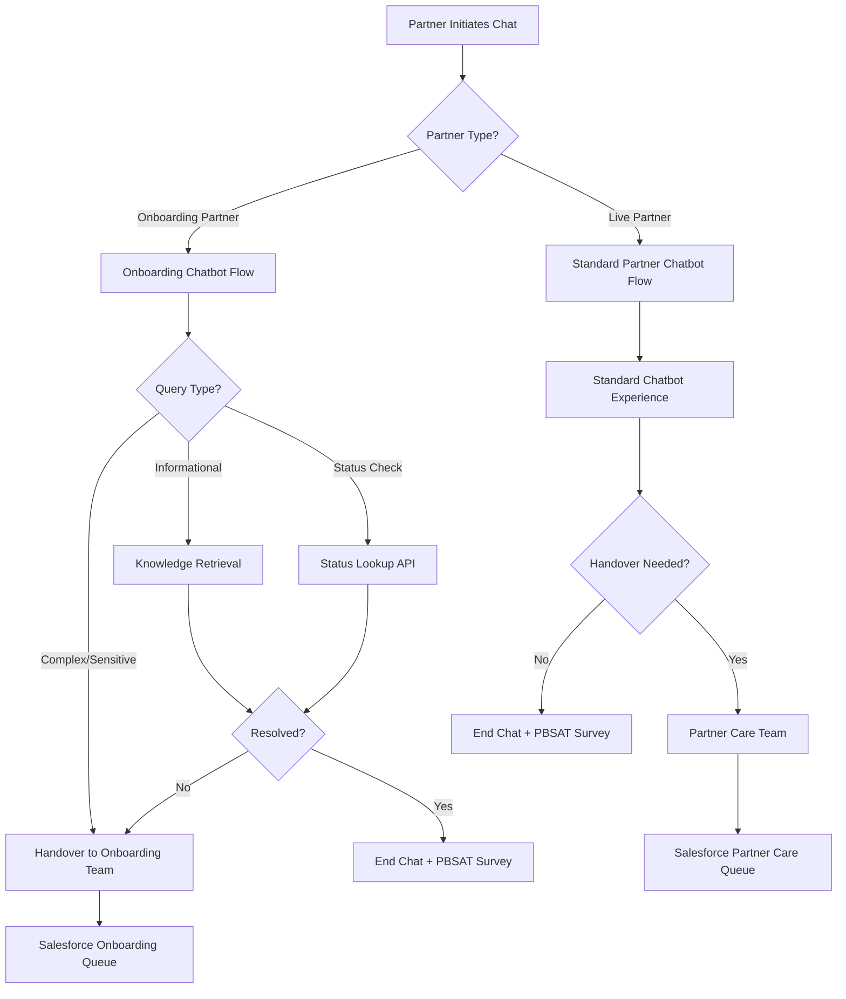
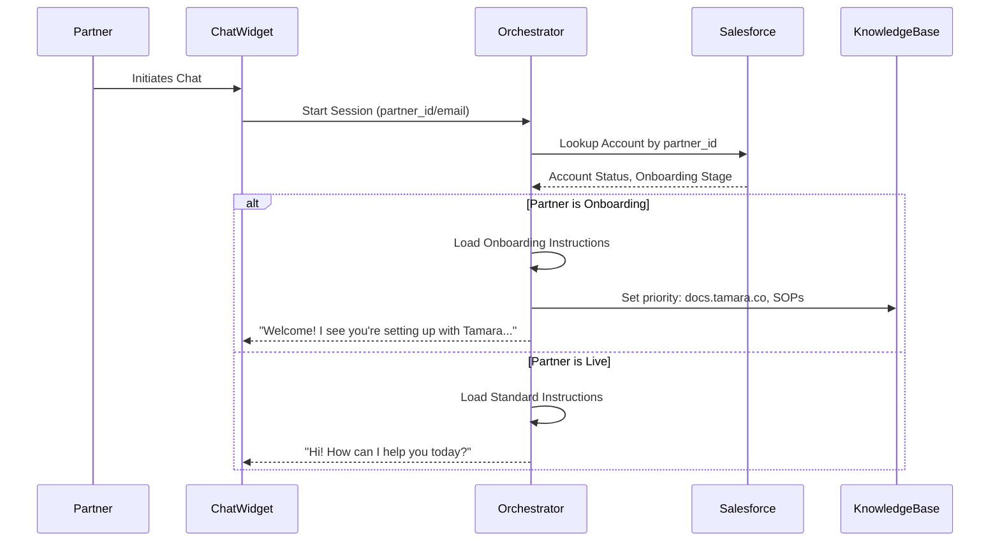

# PRD: Partner Onboarding Chatbot Enhancement

> 📋 **This PRD defines the requirements for extending the Partner AI Chatbot to serve pre-onboarding partners, enabling them to interact with the chatbot instead of being directly routed to human agents.**

---

**Version:** 1.0 | **Status:** Draft | **Created:** February 26, 2026 | **Target Launch:** Q2 2026

---

<details>
<summary><h2>📌 Executive Summary</h2></summary>

The Partner AI Chatbot currently serves two distinct user personas: **live partners** (existing merchants) and **pre-onboarding partners** (new merchants in the signup process). Currently, pre-onboarding partners are immediately routed to the Partner Onboarding team without interacting with the chatbot.

This enhancement extends the chatbot capabilities to handle pre-onboarding partner queries by:

- **Enabling chatbot interaction for onboarding partners** instead of direct agent handoff
- **Expanding the knowledge base** with docs.tamara.co content and Partner Onboarding SOPs
- **Implementing intelligent routing** that distinguishes between onboarding and live partners based on Salesforce configuration
- **Modifying handover flows** to route onboarding partners to the Onboarding team on Salesforce (rather than Partner Care)

This change will reduce agent workload, improve onboarding partner experience, and increase self-service resolution for common onboarding queries.

</details>

---

<details>
<summary><h2>❗ Problem Statement</h2></summary>

### Current State

| Aspect | Current Behavior | Issue |
|--------|------------------|-------|
| **Onboarding Partner Routing** | Direct handoff to human agents | No self-service option for simple queries |
| **Agent Workload** | All onboarding queries handled by agents | High volume of repetitive informational queries |
| **Knowledge Coverage** | Limited to support.tamara.co and tamara.co | Missing docs.tamara.co and onboarding SOPs |
| **Partner Experience** | Inconsistent experience between personas | Onboarding partners wait for agents even for simple questions |

### Business Impact

- **High Agent Load**: Partner Onboarding team handles 100% of pre-onboarding queries, including simple informational requests that could be automated
- **Long Wait Times**: Partners must wait for agent availability even for frequently asked questions (FAQs)
- **Missed Automation Opportunity**: Common onboarding questions (document requirements, application status, timeline) are highly automatable
- **Inconsistent Experience**: Live partners get AI-powered support; onboarding partners get queue-based support

### Pain Points for Pre-Onboarding Partners

1. **"What documents do I need to apply?"** - Currently requires waiting for an agent
2. **"What's the status of my application?"** - No self-service lookup available
3. **"How long does the onboarding process take?"** - Simple informational query routed to agents
4. **"How do I integrate Tamara with my platform?"** - Technical documentation not accessible via chatbot
5. **"Why was my application rejected?"** - Requires context but basic information could be automated

</details>

---

<details>
<summary><h2>🎯 Goals & Objectives</h2></summary>

### Primary Goals

| # | Goal | Description |
|---|------|-------------|
| 1 | **Enable Chatbot for Onboarding Partners** | Pre-onboarding partners will interact with the AI chatbot instead of being directly routed to agents |
| 2 | **Expand Knowledge Base** | Add docs.tamara.co content and Partner Onboarding SOPs to enable self-service for technical and process questions |
| 3 | **Intelligent Partner Classification** | Accurately identify and distinguish between onboarding and live partners using Salesforce configuration |
| 4 | **Optimized Handover Routing** | Route onboarding partner escalations to the Onboarding team (not Partner Care) on Salesforce |

### Secondary Goals

- Reduce Partner Onboarding team workload by deflecting informational queries
- Improve first-response time for onboarding partners
- Create a consistent AI-powered experience across all partner personas
- Enable 24/7 self-service support for onboarding queries

</details>

---

<details>
<summary><h2>📊 Success Metrics</h2></summary>

### Primary Metrics

| Metric | Target | Baseline | Measurement |
|--------|--------|----------|-------------|
| **Deflection Rate for Onboarding Partners** | ≥ 50% | 0% (all queries go to agents) | Percentage of onboarding queries resolved without agent handoff |
| **First Response Time (Onboarding)** | < 5 seconds | ~15 minutes (agent wait time) | Average time to first meaningful response |
| **Onboarding Partner BSAT** | ≥ 65% | N/A (new flow) | Bot Satisfaction Score from in-chat surveys |

### Secondary Metrics

| Metric | Target | Description |
|--------|--------|-------------|
| **Agent Workload Reduction** | -20% | Reduction in onboarding queries handled by agents |
| **Knowledge Base Coverage** | 100% of onboarding FAQs | All common onboarding questions answered by bot |
| **Correct Routing Rate** | ≥ 98% | Accuracy of partner classification (onboarding vs. live) |
| **Handover Success Rate** | ≥ 99% | Successful handover to correct Salesforce queue |

### Operational Metrics

| Metric | Target | Description |
|--------|--------|-------------|
| **Intent Recognition Accuracy** | ≥ 90% | Accuracy of onboarding-specific intent classification |
| **Knowledge Retrieval Relevance** | ≥ 85% | Relevance of retrieved docs.tamara.co content |
| **Handover Queue Accuracy** | 100% | Onboarding partners routed to Onboarding team (not Partner Care) |

</details>

---

<details>
<summary><h2>👤 User Personas</h2></summary>

### Pre-Onboarding Partner (New Persona for Chatbot)

**Description:** Merchants who have started the onboarding process but are not yet live on Tamara. They are in various stages: application submitted, documents pending, integration setup, or approval waiting.

**Key Characteristics:**
- May not have a merchant ID yet
- Authentication via onboarding portal credentials
- Limited access to Partner Portal features
- High interest in process status and requirements

**Common Queries:**
- Application status and timeline
- Document requirements and submission
- Integration guides and technical setup
- Contract and agreement questions
- Rejection reasons and resubmission process

**Key Needs:**
- Quick answers to process questions
- Clear guidance on next steps
- Access to technical documentation
- Status visibility without contacting support

### Live Partner (Existing Persona)

**Description:** Merchants who have completed onboarding and are actively using Tamara for payments.

**Key Characteristics:**
- Has active merchant ID
- Full access to Partner Portal
- Processing transactions
- Established relationship with Tamara

**Common Queries:**
- Settlement and payment inquiries
- Order management and operations
- Technical integration support
- Account and access management

</details>

---

<details>
<summary><h2>💡 Solution Overview</h2></summary>

### High-Level Changes



### Key Components

| Component | Change Required |
|-----------|-----------------|
| **Orchestrator** | Add onboarding partner detection and routing logic |
| **Knowledge Base (MongoDB)** | Add docs.tamara.co content and Partner Onboarding SOPs |
| **Intent Classification** | Add/enhance onboarding-specific intents |
| **Handover Logic** | Route onboarding partners to Onboarding team on Salesforce |
| **Partner Identification** | Integrate with Salesforce to determine partner status |

### Flow Comparison

| Aspect | Current Flow | New Flow |
|--------|--------------|----------|
| **Pre-onboarding Partner** | Direct handoff → Agent | Chatbot → Knowledge retrieval → Handoff if needed |
| **Knowledge Sources** | support.tamara.co, tamara.co | + docs.tamara.co, Partner Onboarding SOPs |
| **Handover Queue** | Partner Care (default) | Onboarding Team (for onboarding partners) |
| **Self-service** | Not available for onboarding | Available for informational queries |

</details>

---

<details>
<summary><h2>📋 Detailed Requirements</h2></summary>

### Orchestrator Modifications

#### Partner Status Detection

The orchestrator must determine partner status at the start of each chat session:

| Field | Source | Values |
|-------|--------|--------|
| `partner_status` | Salesforce Account | `onboarding`, `live`, `churned`, `suspended` |
| `onboarding_stage` | Salesforce Account | `application_submitted`, `documents_pending`, `integration_setup`, `approval_pending`, `live` |
| `has_merchant_id` | Tamara Core | `true`, `false` |

**Logic:**
```
IF partner_status == "onboarding" OR onboarding_stage != "live":
    → Route to Onboarding Chatbot Flow
ELSE:
    → Route to Standard Partner Chatbot Flow
```

#### Onboarding Chatbot Instructions

```yaml
partner_type: onboarding
behavior:
  - Greet partner and acknowledge onboarding status
  - Prioritize onboarding-related knowledge retrieval
  - Use docs.tamara.co as primary knowledge source for technical queries
  - Provide clear next steps and timeline expectations
  - Offer proactive guidance on common onboarding issues
  
knowledge_priority:
  1. Partner Onboarding SOPs
  2. docs.tamara.co (technical documentation)
  3. support.tamara.co (general FAQs)
  
handover_triggers:
  - Application rejection disputes
  - Sensitive document issues
  - Contract/legal queries
  - Complex integration problems (after 2 attempts)
  - Explicit agent request
  
handover_queue: "Partner Onboarding Support"
```

### Knowledge Base Enhancement

#### New Knowledge Sources

| Source | Type | Content |
|--------|------|---------|
| **docs.tamara.co** | Technical Documentation | API reference, integration guides, webhooks, plugins |
| **Partner Onboarding SOPs** | Internal Process Docs | Application process, document requirements, timelines, rejection reasons |

#### Knowledge Structure in MongoDB

```javascript
{
  "_id": ObjectId,
  "source": "docs.tamara.co" | "partner_onboarding_sops",
  "category": "integration" | "onboarding_process" | "requirements" | "faq",
  "title": String,
  "content": String,
  "url": String,
  "tags": [String],
  "partner_stage": ["all" | "application" | "documents" | "integration" | "approval"],
  "language": "en" | "ar",
  "last_updated": Date,
  "embedding": [Float],
  "metadata": {
    "applicable_countries": [String],
    "applicable_platforms": [String],
    "complexity": "beginner" | "intermediate" | "advanced"
  }
}
```

### Onboarding-Specific Intents

| Intent | Sample Queries (EN) | Sample Queries (AR) |
|--------|---------------------|---------------------|
| `onboarding.application_status` | "What's the status of my application?" | "وش وضع طلب الانضمام؟" |
| `onboarding.document_requirements` | "What documents do I need?" | "وش المستندات المطلوبة؟" |
| `onboarding.timeline` | "How long does onboarding take?" | "كم تاخذ عملية التسجيل؟" |
| `onboarding.rejection_reason` | "Why was my application rejected?" | "ليش انرفض طلبي؟" |
| `onboarding.resubmission` | "How do I resubmit my application?" | "كيف أقدم طلب جديد؟" |
| `integration.api_setup` | "How do I set up the API?" | "كيف أربط الـ API؟" |
| `integration.sandbox` | "How do I test in sandbox?" | "كيف أجرب في Sandbox؟" |
| `integration.go_live` | "How do I go live?" | "كيف أحوّل للإنتاج؟" |
| `integration.plugin_setup` | "How do I install the Shopify plugin?" | "كيف أركّب إضافة شوبيفاي؟" |
| `integration.webhook` | "How do I configure webhooks?" | "كيف أضبط الـ Webhooks؟" |

</details>

---

<details>
<summary><h2>🔄 Partner Identification & Routing</h2></summary>

### Salesforce Configuration Fields

The following Salesforce fields determine partner status:

| Field | Object | Description | Values |
|-------|--------|-------------|--------|
| `Account_Status__c` | Account | Overall account status | `Onboarding`, `Live`, `Churned`, `Suspended` |
| `Onboarding_Stage__c` | Account | Current stage in onboarding | `Application Submitted`, `Documents Pending`, `Integration Setup`, `Approval Pending`, `Live` |
| `Go_Live_Date__c` | Account | Date merchant went live | Date or null |
| `Merchant_ID__c` | Account | Tamara Merchant ID | String or null |

### Classification Logic

```python
def classify_partner(salesforce_account):
    # Primary check: Account Status
    if salesforce_account.Account_Status__c == "Onboarding":
        return "onboarding"
    
    # Secondary check: Onboarding Stage
    if salesforce_account.Onboarding_Stage__c != "Live":
        return "onboarding"
    
    # Tertiary check: Go Live Date
    if salesforce_account.Go_Live_Date__c is None:
        return "onboarding"
    
    # Has Merchant ID but not live status (edge case)
    if salesforce_account.Merchant_ID__c and salesforce_account.Account_Status__c != "Live":
        return "onboarding"
    
    return "live"
```

### Session Initialization Flow



### Fallback Handling

| Scenario | Behavior |
|----------|----------|
| Salesforce lookup fails | Default to "live" partner flow (safer) |
| Partner not found in Salesforce | Treat as non-authenticated, offer limited support |
| Ambiguous status | Default to onboarding flow (more restrictive) |

</details>

---

<details>
<summary><h2>🔀 Handover Scenarios</h2></summary>

### Onboarding Partner Handover Triggers

| # | Scenario | Description | Queue |
|---|----------|-------------|-------|
| 1 | **Application Rejection Dispute** | Partner wants to dispute or understand rejection in detail | Partner Onboarding Support |
| 2 | **Sensitive Document Issues** | Problems with identity documents, ownership verification | Partner Onboarding Support |
| 3 | **Contract/Legal Queries** | Questions about contract terms, legal obligations | Partner Onboarding Support |
| 4 | **Complex Integration (2+ Attempts)** | Bot fails to resolve integration issue after 2 attempts | Partner Onboarding Support |
| 5 | **Country Activation** | Request to onboard in additional country | Partner Onboarding Support |
| 6 | **Fraud/Suspicious Activity** | Any fraud-related concerns | Partner Onboarding Support |
| 7 | **Explicit Agent Request** | Partner explicitly asks for human agent | Partner Onboarding Support |
| 8 | **Negative Sentiment** | NLU detects frustration or anger | Partner Onboarding Support |

### Queue Mapping

| Partner Type | Salesforce Queue | Queue ID |
|--------------|------------------|----------|
| **Onboarding Partner** | Partner Onboarding Support | `[SF_QUEUE_ID_ONBOARDING]` |
| **Live Partner** | Partner Care | `[SF_QUEUE_ID_PARTNER_CARE]` |

### Handover Payload

```json
{
  "handover_type": "onboarding_support",
  "partner_info": {
    "partner_id": "string",
    "account_status": "onboarding",
    "onboarding_stage": "documents_pending",
    "company_name": "string",
    "country": "KSA"
  },
  "conversation_summary": {
    "intent": "onboarding.document_requirements",
    "query_summary": "Partner asking about required documents for KSA LLC",
    "bot_attempts": 2,
    "handover_reason": "complex_query_unresolved"
  },
  "queue": "Partner Onboarding Support",
  "priority": "normal"
}
```

### Handover Message Templates

**English:**
> I'll connect you with our Partner Onboarding team who can help you further with this. Please hold while I transfer you – they'll have all the context from our conversation.

**Arabic:**
> بوصلك بفريق دعم التسجيل اللي يقدر يساعدك أكثر في هالموضوع. انتظر شوي وأنا أحولك – راح يكون عندهم كل تفاصيل محادثتنا.

</details>

---

<details>
<summary><h2>📚 Knowledge Base Enhancement</h2></summary>

### docs.tamara.co Content Ingestion

#### Content Sources

| Section | URL Pattern | Priority |
|---------|-------------|----------|
| Getting Started | docs.tamara.co/getting-started/* | High |
| API Reference | docs.tamara.co/api/* | High |
| Integration Guides | docs.tamara.co/integrations/* | High |
| Webhooks | docs.tamara.co/webhooks/* | Medium |
| Plugins | docs.tamara.co/plugins/* | High |
| Testing | docs.tamara.co/testing/* | Medium |
| FAQs | docs.tamara.co/faq/* | High |

#### Ingestion Process

1. **Web Scraping**: Extract content from docs.tamara.co pages
2. **Content Parsing**: Parse HTML to extract structured content (title, body, code snippets)
3. **Chunking**: Split long documents into retrievable chunks (max 1000 tokens)
4. **Embedding Generation**: Generate vector embeddings using existing embedding model
5. **MongoDB Storage**: Store documents with embeddings in knowledge collection
6. **Deduplication**: Ensure no duplicate content across sources

#### Update Strategy

| Frequency | Action |
|-----------|--------|
| Daily | Check for new/updated pages on docs.tamara.co |
| Weekly | Full re-sync and re-embedding |
| On-demand | Manual trigger for urgent updates |

### Partner Onboarding SOPs

#### Content Categories

| Category | Description | Sample Topics |
|----------|-------------|---------------|
| **Application Process** | Step-by-step onboarding flow | Stages, timeline, requirements |
| **Document Requirements** | Required documents by country/entity | CR, VAT, bank details, IDs |
| **Rejection Reasons** | Common rejection scenarios | Incomplete docs, compliance, restrictions |
| **Country-Specific** | Country-specific requirements | KSA, UAE, Kuwait, Egypt, Bahrain |
| **Entity Types** | Requirements by business type | Sole proprietor, LLC, corporation |
| **Integration Requirements** | Technical requirements for go-live | API setup, testing, certification |

### Knowledge Retrieval Priority

| Partner Type | Query Category | Priority 1 | Priority 2 | Priority 3 |
|--------------|----------------|------------|------------|------------|
| Onboarding | Technical/API | docs.tamara.co | SOPs | support.tamara.co |
| Onboarding | Process/Requirements | SOPs | support.tamara.co | docs.tamara.co |
| Onboarding | General FAQ | support.tamara.co | SOPs | docs.tamara.co |
| Live | Any | support.tamara.co | (existing behavior) | |

</details>

---

<details>
<summary><h2>⚙️ Technical Requirements</h2></summary>

### Orchestrator Changes

| Component | Change | Priority |
|-----------|--------|----------|
| **Session Init** | Add Salesforce account lookup | High |
| **Partner Classification** | Implement classification logic | High |
| **Instructions Loader** | Add onboarding-specific instructions | High |
| **Knowledge Router** | Add source priority logic | High |
| **Handover Logic** | Add queue selection based on partner type | High |

### MongoDB Changes

| Collection | Change | Priority |
|------------|--------|----------|
| `knowledge` | Add new documents from docs.tamara.co | High |
| `knowledge` | Add Partner Onboarding SOPs | High |
| `knowledge` | Add `partner_stage` field for filtering | Medium |
| `embeddings` | Generate embeddings for new content | High |

### Salesforce Integration

| API | Purpose | Required Fields |
|-----|---------|-----------------|
| `GET /Account` | Lookup partner status | Account_Status__c, Onboarding_Stage__c, Go_Live_Date__c, Merchant_ID__c |
| `POST /Case` | Create handover case | Queue assignment based on partner type |

### API Requirements

#### New Endpoint: Partner Status Lookup

```
GET /api/v1/partner/status?partner_id={id}

Response:
{
  "partner_id": "string",
  "account_status": "onboarding" | "live" | "churned" | "suspended",
  "onboarding_stage": "application_submitted" | "documents_pending" | "integration_setup" | "approval_pending" | "live",
  "go_live_date": "date" | null,
  "merchant_id": "string" | null,
  "classification": "onboarding" | "live"
}
```

</details>

---

<details>
<summary><h2>🚀 Rollout Plan</h2></summary>

### Timeline

| Phase | Duration | Scope |
|-------|----------|-------|
| **Phase 1: Knowledge Enhancement** | 2 weeks | Ingest docs.tamara.co and SOPs into MongoDB |
| **Phase 2: Orchestrator Update** | 2 weeks | Partner classification and routing logic |
| **Phase 3: Handover Integration** | 1 week | Salesforce queue routing for onboarding partners |
| **Phase 4: Testing** | 2 weeks | UAT, integration testing, pilot rollout |
| **Phase 5: GA Rollout** | 1 week | Full rollout with monitoring |

### Rollout Strategy

| Stage | Percentage | Audience |
|-------|------------|----------|
| Pilot | 10% | Selected onboarding partners (random) |
| Beta | 30% | Expanded pilot with monitoring |
| GA | 100% | All onboarding partners |

### Success Criteria for Each Phase

| Phase | Success Criteria |
|-------|------------------|
| Knowledge Enhancement | ≥ 95% of docs.tamara.co content indexed |
| Orchestrator Update | Partner classification accuracy ≥ 98% |
| Handover Integration | Handover to correct queue 100% of time |
| Testing | Zero critical bugs, BSAT ≥ 60% in pilot |
| GA Rollout | Deflection rate ≥ 40% in first month |

</details>

---

<details>
<summary><h2>⚠️ Dependencies & Risks</h2></summary>

### Dependencies

| Dependency | Owner | Status |
|------------|-------|--------|
| Salesforce Account fields configured | Salesforce Admin | Required |
| docs.tamara.co content accessible for scraping | Developer Experience Team | Required |
| Partner Onboarding SOPs documented | Partner Onboarding Team | Required |
| MongoDB knowledge collection schema update | AI Team | Required |
| Orchestrator update deployment | AI Team | Required |

### Risks & Mitigations

| Risk | Impact | Probability | Mitigation |
|------|--------|-------------|------------|
| **Incorrect partner classification** | Wrong routing, poor experience | Low | Comprehensive testing, fallback to safer flow |
| **Knowledge gaps in docs.tamara.co** | Inability to answer queries | Medium | Pre-launch content audit, feedback loop |
| **SOP content outdated** | Incorrect information provided | Medium | Regular SOP review process, version control |
| **Salesforce API latency** | Slow session initialization | Low | Caching, async lookup, timeout fallback |
| **Handover queue misconfiguration** | Partners routed to wrong team | Low | Pre-launch verification, monitoring alerts |

</details>

---

<details>
<summary><h2>📎 Appendix</h2></summary>

### Glossary

| Term | Definition |
|------|------------|
| **Pre-onboarding Partner** | Merchant who has started but not completed the Tamara onboarding process |
| **Live Partner** | Merchant who has completed onboarding and is actively processing transactions |
| **docs.tamara.co** | Tamara's technical documentation portal for API and integration guides |
| **SOP** | Standard Operating Procedure - internal process documentation |
| **Partner Onboarding Support** | Salesforce queue for onboarding-related queries |
| **Partner Care** | Salesforce queue for live merchant support queries |

### Related Documents

- Partner AI Chatbot PRD (Original)
- Salesforce Integration Documentation
- Knowledge Base Architecture
- docs.tamara.co Content Index

### Change Log

| Version | Date | Author | Changes |
|---------|------|--------|---------|
| 1.0 | Feb 26, 2026 | PRD Agent | Initial draft |

</details>

---

*End of Document*


