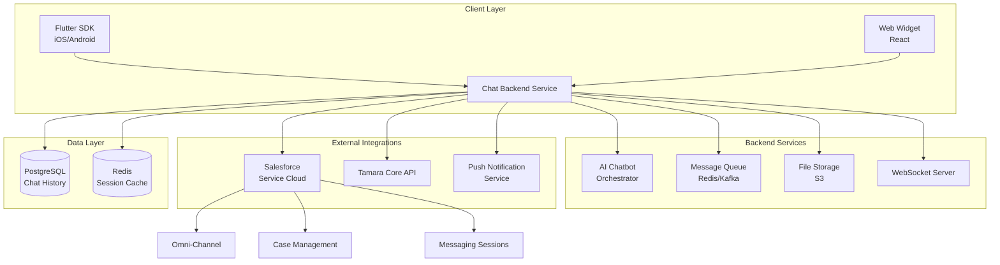
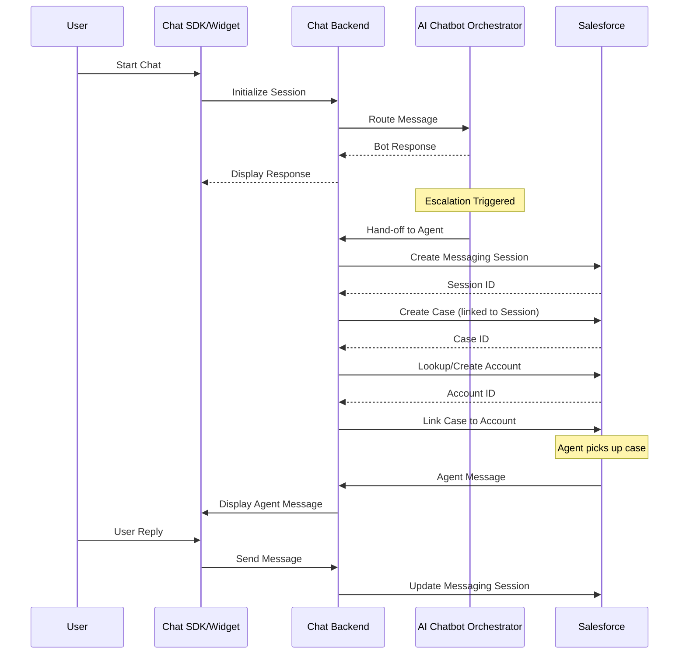
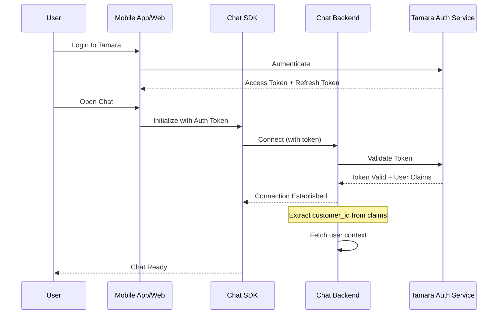
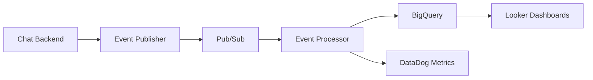
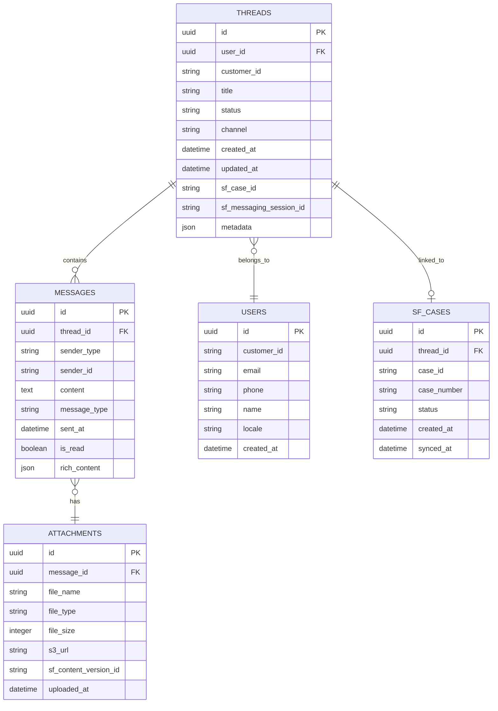

# PRD: Tamara Native Chat System (Flutter SDK + Web Widget)

> 📋 **This PRD defines the comprehensive requirements for building a native chat system for Tamara, including Flutter Chat SDK for mobile apps, Web Chat Widget for all web platforms, and full Salesforce integration for case management. Target launch: April 1st, 2026.**

---

**Version:** 1.0 | **Status:** Draft | **Created:** February 3, 2026 | **Target Launch:** April 1, 2026

---

## 📑 Table of Contents

1. [Executive Summary](#1--executive-summary)
2. [Problem Statement](#2--problem-statement)
3. [Goals & Objectives](#3--goals--objectives)
4. [Success Metrics](#4--success-metrics)
5. [Solution Overview](#5--solution-overview)
6. [Detailed Requirements](#6--detailed-requirements)
7. [Salesforce Integration](#7--salesforce-integration)
8. [Authentication & Security](#8--authentication--security)
9. [Data & Analytics](#9--data--analytics)
10. [Rollout Plan](#10--rollout-plan)
11. [Technical Specifications](#11-%EF%B8%8F-technical-specifications)
12. [Design Guidelines & Branding](#12--design-guidelines--branding)
13. [Key Stakeholders & Approvers](#13--key-stakeholders--approvers)
14. [Dependencies & Risks](#14-%EF%B8%8F-dependencies--risks)
15. [Appendix](#15--appendix)

---

## 1. 📌 Executive Summary

Tamara currently uses the Salesforce Chat SDK embedded in a WebView within its mobile applications. This approach creates a suboptimal user experience with slow load times, limited native functionality, and inconsistent behavior across platforms. Additionally, the web chat widget used across various Tamara web properties lacks integration with our AI chatbot orchestrator and has limited customization options.

This PRD outlines the requirements for building a comprehensive, native chat solution that includes:

- A **Flutter Chat SDK** for iOS and Android (Customer and Partner apps)
- A **Web Chat Widget** for all Tamara web platforms
- Full integration with **Salesforce Service Cloud** for case management
- Seamless integration with **Tamara's AI Chatbot Orchestrator**
- Support for **authenticated and non-authenticated** user experiences
- **Rich messaging capabilities** including carousels, buttons, and file attachments

---

## 2. ❗ Problem Statement

### Current State Issues

| Issue | Description |
|-------|-------------|
| **Performance** | WebView-based implementation causes slow load times and laggy interactions |
| **Native Features** | Limited access to native device features (camera, file system, push notifications) |
| **Consistency** | Inconsistent UI/UX across iOS and Android platforms |
| **AI Integration** | No integration with Tamara's internal AI chatbot - relies on Salesforce Einstein |
| **Branding** | Limited customization and branding options |
| **Rich Messaging** | Difficult to implement advanced message types (carousels, quick replies) |
| **Maintenance** | Maintenance overhead with Salesforce SDK version updates |

### Business Impact

- Current **BSAT (Bot Satisfaction) score: 88%** - target is 92%
- High customer effort scores due to poor chat experience
- Increased support costs from chat abandonment and repeat contacts
- Limited data insights due to Salesforce SDK constraints
- **18,000-30,000 daily chats** impacted by suboptimal experience

---

## 3. 🎯 Goals & Objectives

### Primary Goals

1. **Replace Salesforce Chat SDK/Widget** with native solutions across all platforms
2. **Improve BSAT from 88% to 92%** through enhanced chat experience
3. Enable seamless integration with **Tamara's AI Chatbot Orchestrator**
4. Maintain full **Salesforce case management integration**
5. Support **multi-threaded, persistent chat conversations**

### Secondary Goals

- Reduce chat widget load time by 60%
- Enable rich messaging features (carousels, buttons, quick replies)
- Improve file attachment experience with native integrations
- Support RTL languages (Arabic) with full formatting support
- Enable comprehensive data traceability for analytics

---

## 4. 📊 Success Metrics

### 4.1 Primary Business Metrics

| Metric | Target |
|--------|--------|
| **Salesforce Replacement** | Successful phase-out of Salesforce Chat SDKs/Widgets across all platforms |
| **BSAT Improvement** | Increase from 88% to 92% (4 percentage point improvement) |
| **Case Creation Rate** | 100% of agent-handled cases successfully created in Salesforce |

### 4.2 Product Success Metrics

| Metric | Target | Measurement Method |
|--------|--------|-------------------|
| System Uptime | 99.9% | Infrastructure monitoring (DataDog/CloudWatch) |
| Error Rate | < 0.1% | Error tracking (Sentry/DataDog) |
| Message Delivery Latency (P95) | < 500ms | APM metrics |
| Chat Widget Load Time | < 2 seconds | RUM metrics |
| File Upload Success Rate | > 99% | Backend metrics |
| WebSocket Connection Stability | > 99.5% | Connection monitoring |
| Message Send Success Rate | > 99.9% | Backend metrics |
| Salesforce Sync Success Rate | > 99.5% | Integration monitoring |

### 4.3 User Experience Metrics

| Metric | Target |
|--------|--------|
| **Completion Rate** | Chat session completion rate > 85% |
| **Response Time** | Average chat response time < 1 second for bot responses |
| **Satisfaction** | User satisfaction rating improvement from 3.5 to 4.2+ stars |
| **Abandonment** | Chat abandonment rate < 10% |

---

## 5. 💡 Solution Overview

The solution consists of three main components that work together to provide a unified, native chat experience across all Tamara platforms.

### 5.1 Solution Components

#### 5.1.1 Flutter Chat SDK

- Native Flutter package for iOS and Android
- Integrated with Tamara Customer App and Partner App
- Full access to device features (camera, gallery, file system)
- Push notification support for new messages
- Offline message queuing and sync

#### 5.1.2 Web Chat Widget

- React-based embeddable widget
- Compatible with all Tamara web platforms:
  - Tamara Customer Web App
  - Tamara Partner Portal
  - Tamara Partner Onboarding Portal
  - Support Website (support.tamara.co - Contentful CMS)
- Lightweight and fast-loading
- Responsive design for all screen sizes

#### 5.1.3 Chat Backend Service

- New microservice to handle chat operations
- Real-time messaging infrastructure
- Integration layer with AI Chatbot Orchestrator
- Salesforce API integration for case management
- File storage and management

### 5.2 High-Level Architecture



---

## 6. 📋 Detailed Requirements

### 6.1 Flutter Chat SDK Requirements

#### 6.1.1 Core Chat Functionality

- Real-time bidirectional messaging using WebSocket connections
- Message status indicators (sent, delivered, read)
- Typing indicators
- Message timestamps with timezone support
- Message persistence and history (5-year retention)
- Offline message queuing with automatic retry
- Multi-threaded conversation support
- Thread management (create, archive, search)
- Unread message counts and badges

#### 6.1.2 Rich Message Types

| Message Type | Description |
|--------------|-------------|
| **Text Messages** | Plain text with emoji support, RTL formatting, links |
| **Image Messages** | JPEG, PNG, GIF, WebP support with preview |
| **Document Messages** | PDF with file size display and download |
| **Carousel Messages** | Horizontal scrollable cards with images, titles, descriptions, and actions |
| **Quick Reply Buttons** | Tappable action buttons for common responses |
| **List Messages** | Vertical list of selectable options |
| **System Messages** | Status updates, ticket events, agent handoffs |

#### 6.1.3 File Handling

- Maximum file size: **5MB per file**
- Supported formats: JPEG, PNG, GIF, WebP, PDF
- Native camera and gallery integration
- Document picker integration
- Image compression before upload
- Upload progress indicator
- Retry mechanism for failed uploads
- Storage: **Tamara S3 with Salesforce sync**

#### 6.1.4 Authentication

- Seamless integration with Tamara authentication
- Support for authenticated users (customer_id available)
- Support for non-authenticated/guest users
- Session management and token refresh
- Secure token storage using platform keychain

#### 6.1.5 Localization

- Full **Arabic and English** support
- **RTL layout** support for Arabic
- RTL text formatting including:
  - Bullet points and numbered lists
  - Text alignment
  - Date and time formatting
- Dynamic language switching based on app locale

### 6.2 Web Chat Widget Requirements

#### 6.2.1 Platform Compatibility

- React-based component (compatible with all Tamara web platforms)
- Contentful CMS integration for support.tamara.co
- Embeddable via script tag or npm package
- Responsive design (mobile-first)
- Cross-browser support (Chrome, Safari, Firefox, Edge)

#### 6.2.2 Widget Features

- Floating chat button with unread count badge
- Expandable/collapsible chat window
- Minimized state persistence
- Pre-chat form for non-authenticated users
- All message types supported (same as Flutter SDK)
- File upload via drag-and-drop or file picker
- Keyboard shortcuts for power users

#### 6.2.3 Theming & Branding

- Tamara brand colors and typography
- Configurable primary/secondary colors
- Custom logo support
- Light and dark mode support
- CSS variables for easy customization

### 6.3 Chat Backend Service Requirements

#### 6.3.1 Real-Time Communication

> ⚡ **Recommended Protocol: Socket.IO over WebSocket**
>
> **Justification:**
> - Built-in fallback to HTTP long-polling for restricted networks
> - Automatic reconnection with exponential backoff
> - Room-based messaging for thread management
> - Acknowledgments for message delivery confirmation
> - Binary data support for file transfers
> - Extensive ecosystem and battle-tested in production
>
> **Alternatives Considered:**
> - Raw WebSocket: Lower-level, requires custom reconnection logic
> - Server-Sent Events (SSE): Unidirectional, not suitable for chat
> - gRPC: Overkill for this use case, limited browser support

#### 6.3.2 Message Processing

- Message validation and sanitization
- PII detection and masking
- Rate limiting per user/session
- Message queuing for reliability
- Idempotency keys to prevent duplicates

#### 6.3.3 Integration with AI Chatbot Orchestrator

- Route all messages to existing AI Chatbot Orchestrator
- Receive routing decisions and response content from orchestrator
- Handle hand-off scenarios as defined by the chatbot
- Pass context data (customer_id, order_id, etc.) to orchestrator
- Receive routing fields for Salesforce queue assignment

---

## 7. 🔗 Salesforce Integration

> ⚠️ **All agent-handled cases must be pushed to Salesforce as Messaging Sessions with automatically created Cases. This ensures continuity with existing Care operations and reporting.**

### 7.1 Integration Architecture



### 7.2 Customer Care - Authenticated Chat

When an authenticated chat session gets handed off by the chatbot to an agent:

1. Chat Backend creates a **Messaging Session** in Salesforce
2. Salesforce looks up customer account using `customer_id`
3. If account exists, link session to existing account
4. If account doesn't exist, fetch from Tamara Core and create Person Account
5. Create **Case** linked to Messaging Session and Account
6. Assign to appropriate queue based on routing fields from chatbot

#### Case Fields Mapping

| SF Case Field | Source | Can be Blank? |
|---------------|--------|---------------|
| Order ID | Pushed by chat system | Yes |
| Merchant Name | Pushed by chat system | Yes |
| Merchant ID | Pushed by chat system | Yes |
| Order Status | Pushed by chat system | Yes |
| Order Amount | Pushed by chat system | Yes |
| Authenticated Contact | Yes/No | No |
| Channel | Chat (Customer iOS App), Chat (Customer Android App), Chat (Customer Web App) | No |
| Case Language | AR, EN | No |
| Interaction Type | Complaint, Request, Inquiry, Feedback | Yes |
| Case Subject | Generated from chat context | No |

### 7.3 Customer Care - Non-Authenticated Chat

For non-authenticated chat sessions (e.g., from support website):

- Messaging Session created without customer_id
- No Account or Contact is created
- Case created and linked to Messaging Session only
- Agent can manually identify and link customer later

### 7.4 Partner Care - Authenticated Chat

Similar flow for partner users from Partner Portal or Partner Mobile App:

1. Lookup SF Contact using merchant user credentials
2. If Contact doesn't exist, fetch from Tamara Core and create
3. Create Case linked to Contact and parent Account (Merchant)
4. Route to Partner Care queue

### 7.5 File Attachments Sync

- Files uploaded during chat are stored in Tamara S3
- On case creation/update, files are synced to Salesforce Files
- ContentVersion records created and linked to Case
- Bi-directional sync: agent attachments also sent to chat

### 7.6 API Endpoints

#### Create Messaging Session

```json
POST /services/data/v65.0/sobjects/MessagingSession

{
  "MessagingChannelId": "{{CHANNEL_ID}}",
  "MessagingUserId": "{{USER_ID}}",
  "Status": "Active",
  "StartTime": "2026-02-03T10:00:00Z"
}
```

#### Create Case

```json
POST /services/data/v65.0/sobjects/Case

{
  "AccountId": "{{ACCOUNT_ID}}",
  "Origin": "Chat",
  "Subject": "Chat - Authenticated - EN - SA - John Doe - 2026-02-03T10:00:00Z",
  "Description": "Chat conversation from Tamara App",
  "Order_ID__c": "{{ORDER_ID}}",
  "Channel__c": "Chat (Customer iOS App)",
  "Case_Language__c": "EN",
  "Authenticated_Contact__c": "Yes"
}
```

#### Fetch Customer Details (Tamara Core)

```json
POST {{API_URL}}/customer-care/salesforce/customer

{
  "search_type": "customer_id",
  "search_value": "{{CUSTOMER_ID}}"
}

Response:
{
  "customer_id": "C-12345",
  "first_name": "John",
  "last_name": "Doe",
  "verified_email_address": "john@example.com",
  "phone_number": "+966500000000",
  "country_code": "SA",
  "locale": "en_US",
  "segment": "High Value",
  "membership_tier": "Smart Plus",
  "is_blacklisted": false,
  "is_vulnerable": false
}
```

---

## 8. 🔐 Authentication & Security

### 8.1 Authentication Flow



### 8.2 Authentication Methods

#### Authenticated Users

- JWT token passed from parent application
- Token validated against Tamara Auth Service
- customer_id extracted from token claims
- Session linked to authenticated user
- Token refresh handled automatically

#### Non-Authenticated Users (Guest Mode)

- Anonymous session created with unique session_id
- Optional pre-chat form to collect basic info
- Session data stored temporarily (24-hour TTL)
- Can be upgraded to authenticated session if user logs in

### 8.3 Security Requirements

- All communication over **TLS 1.3**
- WebSocket connections authenticated
- Rate limiting: **60 messages per minute** per user
- **PII masking** for sensitive data in logs
- Data residency: **All data hosted in GCC region**
- Encryption at rest for stored messages
- Webhook signature validation for Salesforce callbacks

> 🔒 **Security Review Required:** This section requires approval from the Cyber Security team before implementation begins.

---

## 9. 📈 Data & Analytics

### 9.1 Data Traceability Requirements

> ⚠️ **PLACEHOLDER:** The following data requirements need to be reviewed and approved by the Data Team.

#### Events to Track

| Event | Description | Fields |
|-------|-------------|--------|
| `chat_session_started` | When a user initiates a chat session | session_id, user_id, platform, timestamp |
| `message_sent` | When a user sends a message | message_id, session_id, message_type, timestamp |
| `message_received` | When a message is received from bot/agent | message_id, session_id, sender_type, timestamp |
| `bot_handoff` | When conversation is handed to an agent | session_id, handoff_reason, queue, timestamp |
| `file_uploaded` | When a user uploads a file | file_id, session_id, file_type, file_size, timestamp |
| `chat_session_ended` | When a chat session ends | session_id, duration, resolution_status, timestamp |
| `csat_submitted` | When user submits satisfaction rating | session_id, rating, feedback, timestamp |

#### Data Storage

- Chat history: **PostgreSQL** with 5-year retention
- Session metadata: **Redis** with 24-hour TTL
- Analytics events: **BigQuery** via event pipeline
- Files: **S3** with Salesforce sync

#### Data Pipeline



---

## 10. 🚀 Rollout Plan

### 10.1 Timeline Overview

| Milestone | Date |
|-----------|------|
| Development Start | February 10, 2026 |
| Target Launch | April 1, 2026 |
| Total Duration | ~7 weeks |

### 10.2 Phase 1: Development (Feb 10 - Mar 15)

#### Week 1-2: Foundation

- Set up Chat Backend Service infrastructure
- Implement WebSocket/Socket.IO server
- Design and implement database schema
- Create Flutter SDK project structure
- Create Web Widget project structure

#### Week 3-4: Core Features

- Implement message sending/receiving
- AI Chatbot Orchestrator integration
- Basic message types (text, image, document)
- Authentication integration

#### Week 5-6: Advanced Features

- Rich message types (carousel, buttons)
- File upload functionality
- Salesforce integration
- Multi-threading support

### 10.3 Phase 2: Testing (Mar 16 - Mar 25)

- Internal testing with QA team
- Integration testing with Salesforce
- Performance testing (load testing up to 30k concurrent sessions)
- Security testing and penetration testing
- UAT with internal stakeholders

### 10.4 Phase 3: Phased Rollout (Mar 26 - Apr 1)

> 🚦 **Feature Gate:** Statsig will be used to control which users see the new chat experience. This allows for gradual rollout and instant rollback if issues arise.

#### Rollout Schedule

| Date | Percentage | Audience |
|------|------------|----------|
| Mar 26 | 5% | Internal + beta testers |
| Mar 28 | 25% | Early adopters |
| Mar 30 | 50% | General users |
| Apr 1 | 100% | GA (General Availability) |

#### Rollback Criteria

- Error rate exceeds 1%
- Message delivery latency exceeds 2 seconds (P95)
- Salesforce sync failure rate exceeds 5%
- Critical bugs reported by users

### 10.5 Fallback Mechanism

> ⚡ **Automatic Fallback:** If the new chat system experiences issues, users will automatically be redirected to the existing Salesforce Chat Widget. This is controlled by the Statsig feature gate and health check monitoring.

- Health check endpoint monitors new chat system
- If health check fails 3 consecutive times, trigger fallback
- Users seamlessly redirected to Salesforce Chat Widget
- Automatic recovery when health check passes

---

## 11. ⚙️ Technical Specifications

### 11.1 Technology Stack

#### Flutter SDK

- Flutter 3.x
- Dart 3.x
- socket_io_client for WebSocket
- flutter_secure_storage for token storage
- cached_network_image for image handling

#### Web Widget

- React 18
- TypeScript
- Socket.IO client
- Styled Components / CSS Modules
- Bundled as UMD for easy embedding

#### Chat Backend

- Node.js / Go (TBD based on team expertise)
- Socket.IO server
- PostgreSQL for persistence
- Redis for caching and pub/sub
- Kubernetes deployment

### 11.2 API Contracts

#### WebSocket Events

```typescript
// Client -> Server Events
{
  "connect": { token: string },
  "message:send": { 
    thread_id: string, 
    content: string, 
    type: "text" | "image" | "document",
    attachments?: [{ url: string, type: string, name: string }]
  },
  "typing:start": { thread_id: string },
  "typing:stop": { thread_id: string },
  "thread:create": { initial_message: string },
  "thread:archive": { thread_id: string }
}

// Server -> Client Events
{
  "message:new": {
    id: string,
    thread_id: string,
    content: string,
    type: "text" | "carousel" | "buttons" | "system",
    sender: "user" | "bot" | "agent",
    timestamp: string,
    metadata?: object
  },
  "thread:updated": { thread_id: string, status: string },
  "typing:indicator": { thread_id: string, sender: string },
  "agent:assigned": { thread_id: string, agent_name: string },
  "error": { code: string, message: string }
}
```

#### REST API Endpoints

```typescript
// Chat Service REST API

GET /api/v1/threads
  - List all threads for authenticated user
  - Query params: status, limit, cursor

GET /api/v1/threads/:thread_id/messages
  - Get messages for a thread
  - Query params: limit, before_id, after_id

POST /api/v1/threads
  - Create new thread
  - Body: { initial_message: string }

POST /api/v1/threads/:thread_id/messages
  - Send message (alternative to WebSocket)
  - Body: { content: string, type: string, attachments?: [] }

POST /api/v1/upload
  - Upload file
  - Multipart form data
  - Returns: { url: string, file_id: string }

GET /api/v1/health
  - Health check endpoint
  - Returns: { status: "healthy" | "degraded" | "unhealthy" }
```

### 11.3 Database Schema



---

## 12. 🎨 Design Guidelines & Branding

> ⚠️ **PLACEHOLDER:** Design specifications, mockups, and branding guidelines to be added by the Design Team.

### 12.1 Design Requirements

- Follow Tamara Design System
- Consistent with existing app UI/UX
- Mobile-first responsive design
- Accessibility compliance (WCAG 2.1 AA)
- Support for both light and dark modes

### 12.2 Branding Elements

- Primary brand colors
- Typography (font family, sizes, weights)
- Icon library
- Animation guidelines
- Spacing and layout grid

### 12.3 Design Deliverables

- [ ] Figma designs for Flutter SDK UI components
- [ ] Figma designs for Web Widget
- [ ] Interactive prototypes
- [ ] Design specifications document
- [ ] Asset library (icons, illustrations)

---

## 13. 👥 Key Stakeholders & Approvers

> ⚠️ **PLACEHOLDER:** Stakeholder and approver details to be added.

### 13.1 Product

- [Name] - Product Manager
- [Name] - Product Owner

### 13.2 Engineering

- [Name] - Engineering Manager
- [Name] - Tech Lead - Mobile
- [Name] - Tech Lead - Backend
- [Name] - Tech Lead - Web

### 13.3 Operations

- [Name] - Customer Care Operations Lead
- [Name] - Partner Care Operations Lead

### 13.4 Other Stakeholders

- [Name] - Cyber Security
- [Name] - Data Team
- [Name] - Design Lead
- [Name] - Salesforce Admin

### 13.5 Approvals Required

- [ ] Product Review
- [ ] Technical Review
- [ ] Security Review
- [ ] Data Team Review
- [ ] Design Review
- [ ] Operations Review

---

## 14. ⚠️ Dependencies & Risks

### 14.1 Dependencies

| Dependency | Owner | Status |
|------------|-------|--------|
| AI Chatbot Orchestrator must be ready for integration | AI Team | TBD |
| Salesforce API access and permissions | Salesforce Admin | TBD |
| Tamara Auth Service token validation endpoint | Platform Team | TBD |
| S3 bucket setup for file storage | Infrastructure | TBD |
| Statsig feature gate configuration | Infrastructure | TBD |
| Push notification service integration | Mobile Team | TBD |

### 14.2 Risks & Mitigations

| Risk | Description | Mitigation | Severity |
|------|-------------|------------|----------|
| **Timeline Risk** | Aggressive 7-week timeline | Prioritize MVP features, defer nice-to-haves | Medium |
| **Integration Risk** | Complex Salesforce integration | Early integration testing, dedicated SF admin support | High |
| **Performance Risk** | Handling 30k daily chats | Load testing, auto-scaling infrastructure | Medium |
| **Adoption Risk** | Users may resist change | Phased rollout, fallback mechanism, user feedback loop | Low |
| **Data Loss Risk** | Message delivery failures | Message queuing, retry mechanisms, monitoring | Medium |

---

## 15. 📎 Appendix

### 15.1 Glossary

| Term | Definition |
|------|------------|
| **BSAT** | Bot Satisfaction Score - measure of customer satisfaction with chatbot interactions |
| **Messaging Session** | Salesforce object representing a chat conversation |
| **Person Account** | Salesforce account type for B2C customers |
| **Omni-Channel** | Salesforce feature for routing cases to agents |
| **Socket.IO** | Real-time bidirectional event-based communication library |
| **Statsig** | Feature flagging and A/B testing platform |

### 15.2 Related Documents

- Salesforce for Care - Integration Technical Documentation
- AI Chatbot Orchestrator PRD
- Tamara Design System
- Tamara API Documentation

### 15.3 Change Log

| Version | Date | Author | Changes |
|---------|------|--------|---------|
| 1.0 | Feb 3, 2026 | PRD Agent | Initial draft |

---

*End of Document*


