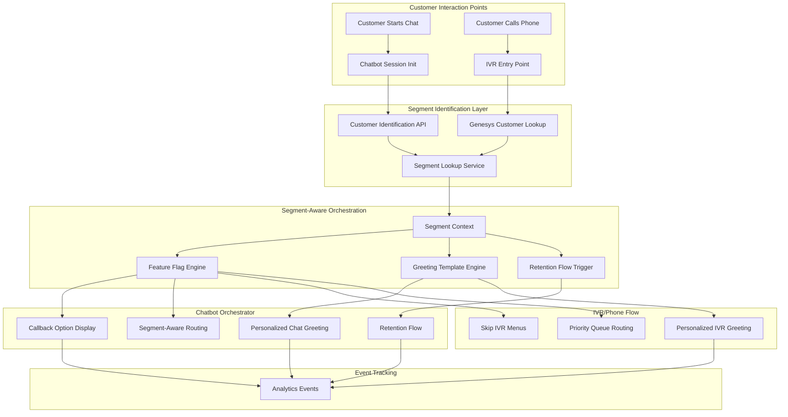
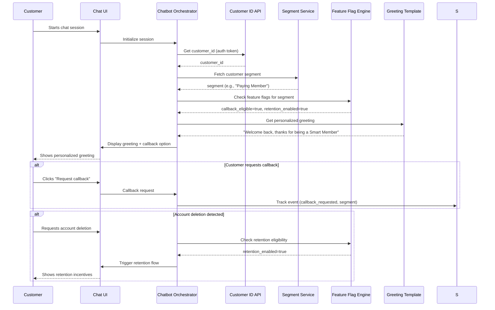
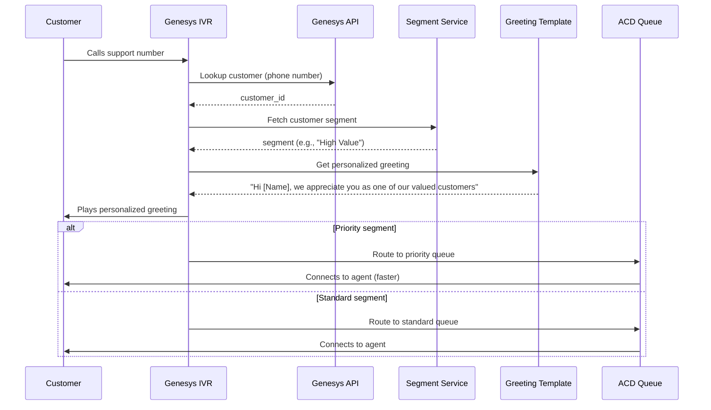
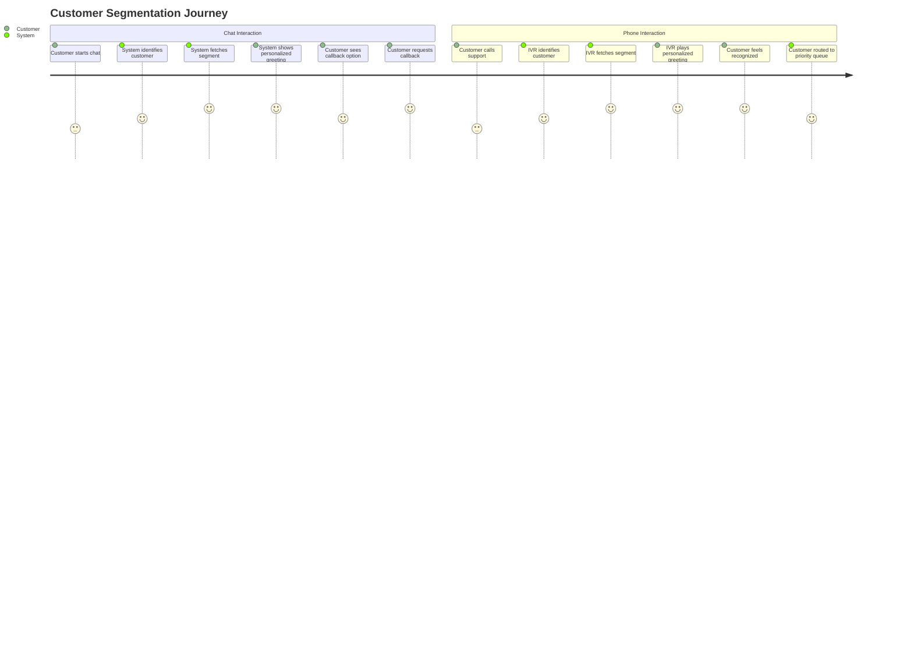
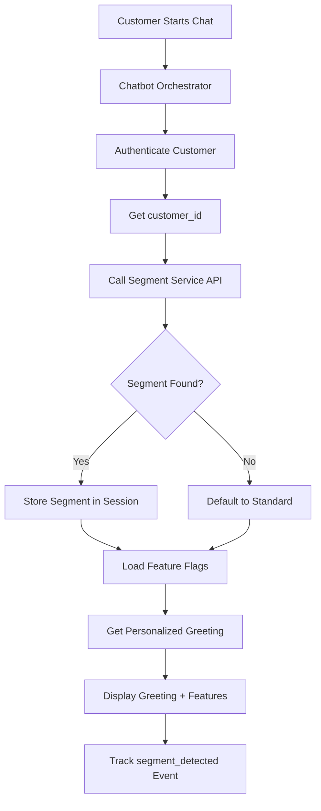
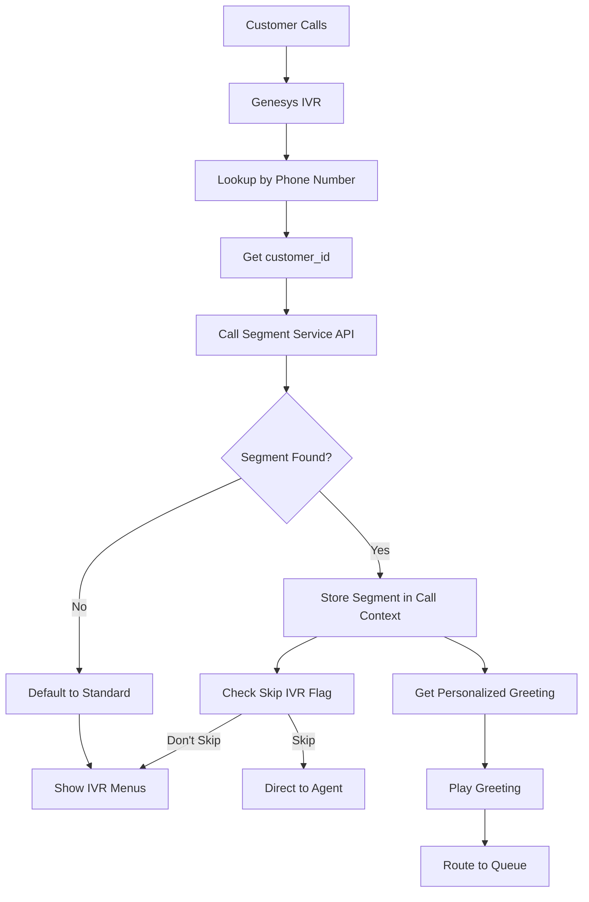

# Product Requirements Document

# Customer Segmentation Enablement: Personalized Chatbot & IVR Experiences

**Version:** 1.0  
**Phase:** Phase 1 - Q1 2026  
**Generated:** January 15, 2026  
**Status:** Draft

---

## 📌 Introduction

This PRD defines the requirements for enabling **segment-aware, personalized experiences** in both the **AI Chatbot** and **Phone IVR/Agent Handoff** flows. This initiative combines two complementary ideas:

1. **Chatbot Segmentation Enablement** - Fetch customer segment at chat session start and adapt flows, features, and greetings based on segment
2. **IVR Personalized Greetings** - Enable automated, personalized greetings in phone IVR/agent handoff flows based on customer segmentation

This work enables differentiated support experiences aligned with the **Customer Segmentation Framework** (Paying Member, High Value, Potential High Value, Trial Member, Standard, No Orders) and supports the strategic goal of increasing customer satisfaction, retention, and LTV while reducing churn for priority segments.

**Related Documents:**
- [Customer Segmentation Framework](https://www.notion.so/tamaracom/Customer-Segmentation-2d462429127880968d0ac88efea7071e)
- [Differentiated Support Offerings](https://www.notion.so/tamaracom/Customer-Segmentation-2d462429127880968d0ac88efea7071e)

---

## ❗ Problem Statement

### Current State Problems

**1. Generic Chatbot Experience**
- Chatbot treats all customers identically, regardless of their value or membership status
- No segment-aware feature flags (callback eligibility, retention flows)
- Generic greetings that don't acknowledge customer status
- Missed opportunities to prioritize higher-value users and fast-track help

**2. Generic IVR/Phone Greetings**
- Current phone greetings are generic and don't reflect customer membership or value tier
- Customers miss opportunities to feel recognized for their status
- Weakens retention and satisfaction for priority segments
- No consistency between voice and digital channels

**3. Fragmented Experience**
- Chat and phone experiences are disconnected
- No unified recognition across channels
- Inconsistent customer experience

### Impact

- **Low deflection rates** - Generic chatbot doesn't leverage segment value
- **Higher churn risk** - Priority segments don't feel recognized
- **Missed revenue protection** - No special handling for high-value customers
- **Poor CES/NPS** - Customers don't feel valued
- **Inefficient routing** - All customers treated the same regardless of segment

---

## 🎯 Goals

### 1. Enable Segment-Aware Chatbot Experiences
**Description:** Fetch customer segment at chat session initialization and adapt chatbot flows, features, and greetings based on segment.

**Target:** 
- 100% of chat sessions fetch segment at init
- Segment-aware features (callback, retention) shown to eligible segments
- Personalized greetings for Paying Member, High Value, Trial Member segments

### 2. Enable Personalized IVR Greetings
**Description:** Integrate segmentation into IVR/phone flows to provide personalized greetings that recognize customer membership and value tier.

**Target:**
- 100% of phone calls identify customer segment
- Personalized greetings for Smart Members, Valued Customers, Trial Members
- Consistent recognition across voice and digital channels

### 3. Increase Deflection and CES
**Description:** Segment-aware flows increase relevance, reduce friction, and protect revenue/loyalty.

**Target:**
- Increase chatbot deflection by 15% for priority segments
- Improve CES by 10% for Paying Member and High Value segments
- Reduce churn by 5% for priority segments

### 4. Enable Retention Intercepts
**Description:** Detect and intercept churn moments for priority segments through segment-aware retention flows.

**Target:**
- 80% of account deletion attempts from priority segments trigger retention flow
- 30% retention success rate for priority segments

---

## 📊 Success Metrics

| Metric | Target | Baseline | Measurement |
|--------|--------|----------|-------------|
| **Segment Detection Rate** | 100% | 0% | % of chat/phone interactions with segment identified |
| **Personalized Greeting Display Rate** | ≥ 95% | 0% | % of eligible interactions showing personalized greeting |
| **Callback Request Rate (Priority Segments)** | ≥ 20% | 0% | % of eligible segments requesting callback |
| **Chatbot Deflection Increase** | +15% | Current baseline | Deflection rate improvement for priority segments |
| **CES Improvement (Priority Segments)** | +10% | Current baseline | CES score improvement for Paying Member/High Value |
| **Churn Reduction (Priority Segments)** | -5% | Current baseline | Churn rate reduction for priority segments |
| **Retention Flow Trigger Rate** | ≥ 80% | 0% | % of deletion attempts from priority segments triggering retention |
| **Retention Success Rate** | ≥ 30% | 0% | % of retention flows resulting in account retention |

---

## 👤 User Personas & Segments

### Customer Segments

| **Rank** | **Segment** | **Definition** | **Priority** |
| --- | --- | --- | --- |
| 1 | **🏆 Paying Member** | Customers who transacted with Tamara and are currently Smart/Smart+ members past trial period | **Highest** |
| 2 | **🏅 High Value** | Customers who generated GMV of +$5K in last rolling 12 months | **High** |
| 3 | **🥇 Potential High Value** | Customers who generated GMV between $3K-$5K in last rolling 12 months | **Medium** |
| 4 | **🥈 Trial Member** | Customers in Smart membership trial period with GMV < $3K in last 12 months | **High** |
| 5 | **👤 Standard** | Customers with GMV < $3K in last 12 months | **Standard** |
| 6 | **🧟 No Orders** | Registered customers with no captured orders (lifetime) | **Standard** |

### Segment Priorities for Features

**Callback Eligibility:**
- ✅ Paying Member
- ✅ High Value
- ✅ Trial Member
- ❌ Potential High Value (Phase 2)
- ❌ Standard / No Orders

**Personalized Greetings:**
- ✅ Paying Member (Smart Member recognition)
- ✅ High Value (Valued Customer recognition)
- ✅ Trial Member (Smart Member recognition)
- ❌ Other segments (standard greeting)

**Retention Flows:**
- ✅ Paying Member
- ✅ High Value
- ✅ Trial Member
- ✅ Potential High Value
- ❌ Standard / No Orders

---

## 💡 Solution

### Solution Overview

Implement segment-aware experiences across chatbot and IVR by:

1. **Segment Lookup at Interaction Start**
   - Fetch customer segment via CRM/semantic layer API
   - Store segment in session context
   - Use segment to drive feature flags and personalization

2. **Chatbot Segment-Aware Features**
   - Personalized greetings based on segment
   - Callback option shown only to eligible segments
   - Retention flows triggered for priority segments
   - Segment-specific routing and SLA handling

3. **IVR Personalized Greetings**
   - Customer identification via Genesys API
   - Segment lookup during IVR flow
   - Dynamic greeting selection based on segment
   - Consistent recognition across channels

4. **Event Instrumentation**
   - Track segment detection events
   - Monitor callback requests by segment
   - Track retention flow triggers and outcomes
   - Measure greeting engagement

---

## 📐 Solution Design

### Architecture Overview



### Chatbot Flow Sequence



### IVR Flow Sequence



### Customer Journey Flow



---

## 🔧 Implementation Approach

### 1. Chatbot Orchestrator Integration

**Location:** AI Chatbot Orchestrator - Session Initialization Module

**Implementation Steps:**

1. **Session Init Hook**
   - Add segment lookup call immediately after customer authentication
   - Store segment in session context object
   - Make segment available to all orchestrator components

2. **Feature Flag Integration**
   - Create segment-based feature flag rules
   - Check flags before showing callback option
   - Check flags before triggering retention flows

3. **Greeting Template Integration**
   - Add greeting template selection based on segment
   - Support AR/EN localization
   - Inject customer name when available

4. **Event Instrumentation**
   - Add segment_detected event on session init
   - Add callback_shown event when option displayed
   - Add callback_requested event on user action
   - Add retention_shown and retention_abandoned/retained events

**Code Structure:**
```python
# Chatbot Orchestrator - Session Init
class ChatbotSession:
    def __init__(self, customer_id, auth_token):
        self.customer_id = customer_id
        self.segment = None
        self.feature_flags = {}
        
    async def initialize(self):
        # 1. Authenticate customer
        customer = await authenticate_customer(self.auth_token)
        
        # 2. Fetch segment
        self.segment = await fetch_customer_segment(customer.id)
        
        # 3. Load feature flags
        self.feature_flags = await get_segment_feature_flags(self.segment)
        
        # 4. Get personalized greeting
        greeting = await get_personalized_greeting(self.segment, customer.name)
        
        # 5. Track event
        track_event('segment_detected', {
            'customer_id': customer.id,
            'segment': self.segment,
            'channel': 'chat'
        })
        
        return {
            'greeting': greeting,
            'callback_eligible': self.feature_flags.get('callback_eligible', False),
            'retention_enabled': self.feature_flags.get('retention_enabled', False)
        }
```

### 2. Genesys IVR Integration

**Location:** Genesys IVR Tree - Customer Identification Node

**Implementation Steps:**

1. **Customer Identification Node**
   - Add customer lookup via Genesys API (phone number → customer_id)
   - Call segment lookup service
   - Store segment in call context

2. **Greeting Selection Node**
   - Add conditional logic based on segment
   - Select appropriate greeting template (AR/EN)
   - Inject customer name if available

3. **Routing Logic**
   - Update ACD routing based on segment
   - Priority segments → Priority queue
   - Standard segments → Standard queue

4. **IVR Menu Skip Logic**
   - Add segment check before IVR menu
   - Skip menus for eligible segments (Paying Member, High Value, Trial Member)
   - Direct to agent or callback option

**Genesys IVR Tree Structure:**
```
IVR Entry Point
  ├─ Customer Identification
  │   ├─ Lookup by Phone Number (Genesys API)
  │   └─ Fetch Segment (Segment Service)
  ├─ Segment Check
  │   ├─ Priority Segment? → Skip Menus
  │   └─ Standard Segment? → Show Menus
  ├─ Personalized Greeting
  │   ├─ Paying Member → "Hi [Name], thanks for being a Smart Member"
  │   ├─ High Value → "Hi [Name], we appreciate you as a valued customer"
  │   ├─ Trial Member → "Hi [Name], thanks for being a Smart Member"
  │   └─ Standard → Default greeting
  └─ Routing
      ├─ Priority Queue (Paying Member, High Value, Trial Member)
      └─ Standard Queue (Other segments)
```

### 3. API Requirements

#### 3.1 Customer Identification API (Chatbot)

**Endpoint:** `GET /api/v1/customers/{customer_id}/segment`

**Purpose:** Fetch customer segment for chatbot session initialization

**Request:**
```json
GET /api/v1/customers/{customer_id}/segment
Headers:
  Authorization: Bearer {auth_token}
```

**Response:**
```json
{
  "customer_id": "12345",
  "segment": "Paying Member",
  "segment_code": "PAYING_MEMBER",
  "segment_rank": 1,
  "metadata": {
    "membership_status": "active",
    "membership_type": "Smart",
    "gmv_l12m": 8500.00,
    "trial_period": false
  },
  "feature_flags": {
    "callback_eligible": true,
    "retention_enabled": true,
    "skip_ivr_menus": true,
    "priority_routing": true
  },
  "last_updated": "2026-01-15T10:30:00Z"
}
```

**Error Handling:**
- 404: Customer not found → Default to "Standard" segment
- 500: Service error → Default to "Standard" segment, log error

#### 3.2 Genesys Customer Lookup API

**Endpoint:** Genesys Cloud API - Customer Lookup by Phone Number

**Purpose:** Identify customer by phone number in IVR flow

**Genesys Cloud API Documentation:**
- Base URL: `https://api.{region}.genesys.cloud`
- Authentication: OAuth 2.0 Client Credentials Grant
- API Version: v2

**Request:**
```json
GET /api/v2/analytics/conversations/details/query
Headers:
  Authorization: Bearer {genesys_oauth_token}
  Content-Type: application/json

Body:
{
  "interval": "2026-01-15T00:00:00.000Z/2026-01-15T23:59:59.999Z",
  "conversationFilters": [
    {
      "type": "or",
      "predicates": [
        {
          "type": "dimension",
          "dimension": "participantName",
          "operator": "matches",
          "value": "{phone_number}"
        }
      ]
    }
  ]
}
```

**Alternative Approach (Recommended):**
Use Genesys Contact Center API to lookup customer by phone number from contact list or use internal customer database lookup:

```json
POST /api/v2/routing/contacts/search
Headers:
  Authorization: Bearer {genesys_oauth_token}
  Content-Type: application/json

Body:
{
  "query": [
    {
      "type": "EXACT",
      "fields": ["phoneNumber"],
      "value": "+966501234567"
    }
  ]
}
```

**Response:**
```json
{
  "results": [
    {
      "id": "contact-id-123",
      "phoneNumber": "+966501234567",
      "externalId": "customer_12345",
      "data": {
        "customer_id": "12345",
        "name": "Ahmed Al-Saud"
      }
    }
  ]
}
```

**Note:** If Genesys API doesn't return customer_id directly, use phone number to lookup in internal customer database, then call Segment Service API.

#### 3.3 Segment Service API

**Endpoint:** `GET /api/v1/segments/{customer_id}`

**Purpose:** Centralized segment lookup service

**Request:**
```json
GET /api/v1/segments/{customer_id}
Headers:
  Authorization: Bearer {service_token}
```

**Response:**
```json
{
  "customer_id": "12345",
  "segment": "Paying Member",
  "segment_code": "PAYING_MEMBER",
  "segment_rank": 1,
  "country": "SA",
  "calculated_at": "2026-01-15T10:30:00Z",
  "criteria": {
    "has_transactions": true,
    "is_smart_member": true,
    "past_trial_period": true,
    "gmv_l12m": 8500.00
  }
}
```

**Caching:** Segment data cached for 1 hour to reduce API calls

#### 3.4 Chatbot Authentication API

**Endpoint:** `POST /api/v1/auth/chatbot/authenticate`

**Purpose:** Authenticate customer for chatbot session and return customer_id

**Request:**
```json
POST /api/v1/auth/chatbot/authenticate
Headers:
  Content-Type: application/json

Body:
{
  "auth_token": "{jwt_token_or_session_token}",
  "device_id": "{optional_device_identifier}",
  "channel": "chat"
}
```

**Response:**
```json
{
  "customer_id": "12345",
  "customer_name": "Ahmed Al-Saud",
  "email": "ahmed@example.com",
  "phone_number": "+966501234567",
  "session_token": "{new_session_token}",
  "expires_at": "2026-01-15T11:30:00Z"
}
```

**Error Handling:**
- 401: Invalid token → Return error, require re-authentication
- 404: Customer not found → Return error
- 500: Service error → Return error, log for investigation

---

## 📝 Suggested Copy

### Chatbot Greetings

#### English

**Paying Member:**
- "Welcome back! Thanks for being a Smart Member with Tamara. How can I help you today?"
- "Hi! We appreciate you as a Smart Member. What can I assist you with?"

**High Value:**
- "Welcome! We value you as one of our most important customers. How can I help you today?"
- "Hi! Thank you for being a valued customer. What can I assist you with?"

**Trial Member:**
- "Welcome! Thanks for being a Smart Member. How can I help you today?"
- "Hi! We're glad you're trying Smart Membership. What can I assist you with?"

**Standard:**
- "Welcome! How can I help you today?"
- "Hi! What can I assist you with?"

#### Arabic (Saudi Dialect)

**Paying Member:**
- "أهلاً وسهلاً! شكراً لكونك عضو سمارت مع تمارا. كيف أقدر أساعدك اليوم؟"
- "مرحباً! نقدرك كعضو سمارت. كيف أقدر أساعدك؟"

**High Value:**
- "أهلاً وسهلاً! نقدرك كواحد من عملائنا المهمين. كيف أقدر أساعدك اليوم؟"
- "مرحباً! شكراً لكونك عميل مميز. كيف أقدر أساعدك؟"

**Trial Member:**
- "أهلاً وسهلاً! شكراً لكونك عضو سمارت. كيف أقدر أساعدك اليوم؟"
- "مرحباً! نحن سعداء إنك جربت عضوية سمارت. كيف أقدر أساعدك؟"

**Standard:**
- "أهلاً وسهلاً! كيف أقدر أساعدك اليوم؟"
- "مرحباً! كيف أقدر أساعدك؟"

### IVR Greetings

#### English

**Paying Member:**
- "Hi [Name], thanks for being a Smart Member with Tamara. Please hold while we connect you to one of our agents."
- "Hello [Name], we appreciate you as a Smart Member. You'll be connected to an agent shortly."

**High Value:**
- "Hi [Name], we appreciate you as one of our valued customers. Please hold while we connect you."
- "Hello [Name], thank you for being a valued customer. You'll be connected to an agent shortly."

**Trial Member:**
- "Hi [Name], thanks for being a Smart Member with Tamara. Please hold while we connect you."
- "Hello [Name], we're glad you're trying Smart Membership. You'll be connected shortly."

**Standard:**
- "Thank you for calling Tamara support. Please hold while we connect you to an agent."
- "Hello, thank you for contacting Tamara. You'll be connected shortly."

#### Arabic (Saudi Dialect)

**Paying Member:**
- "أهلاً [الاسم]، شكراً لكونك عضو سمارت مع تمارا. انتظر من فضلك بينما نوصلوك مع أحد وكلائنا."
- "مرحباً [الاسم]، نقدرك كعضو سمارت. راح نوصلوك مع وكيل قريباً."

**High Value:**
- "أهلاً [الاسم]، نقدرك كواحد من عملائنا المميزين. انتظر من فضلك بينما نوصلوك."
- "مرحباً [الاسم]، شكراً لكونك عميل مميز. راح نوصلوك مع وكيل قريباً."

**Trial Member:**
- "أهلاً [الاسم]، شكراً لكونك عضو سمارت مع تمارا. انتظر من فضلك بينما نوصلوك."
- "مرحباً [الاسم]، نحن سعداء إنك جربت عضوية سمارت. راح نوصلوك قريباً."

**Standard:**
- "شكراً لتواصلك مع دعم تمارا. انتظر من فضلك بينما نوصلوك مع وكيل."
- "مرحباً، شكراً لتواصلك مع تمارا. راح نوصلوك قريباً."

### Callback Option Copy

#### English
- "Would you like to request a callback instead of waiting? We'll call you back when an agent is available."
- "You can request a callback to maintain your place in queue. Would you like to do that?"

#### Arabic (Saudi Dialect)
- "هل تريد طلب اتصال بدلاً من الانتظار؟ راح نتصل عليك لما يكون عندنا وكيل متاح."
- "تقدر تطلب اتصال عشان تحافظ على مكانك في الطابور. تبي نسوي كذا؟"

---

## ✅ In-Scope Features

| Feature | Description | Priority |
| --- | --- | --- |
| **Segment Lookup at Chat Init** | Fetch customer segment during chatbot session initialization | P0 |
| **Segment Lookup at IVR Entry** | Identify customer and fetch segment in IVR flow | P0 |
| **Personalized Chat Greetings** | Show segment-based greetings in chatbot | P0 |
| **Personalized IVR Greetings** | Play segment-based greetings in phone IVR | P0 |
| **Callback Option (Chat)** | Show callback option to eligible segments in chatbot | P0 |
| **Retention Flow Trigger** | Trigger retention flow for priority segments on deletion attempt | P0 |
| **IVR Menu Skip** | Skip IVR menus for priority segments | P0 |
| **Priority Routing** | Route priority segments to priority queues | P0 |
| **Event Instrumentation** | Track segment detection, callback requests, retention flows | P0 |
| **AR/EN Localization** | Support Arabic and English for all greetings | P0 |

---

## ❌ Out-of-Scope Features

| Feature | Reason | Phase |
| --- | --- | --- |
| Segment-based compensation | Different initiative | Phase 2 |
| Segment-based SLA enforcement | Different initiative | Phase 2 |
| Multi-segment handling | Not required for Phase 1 | Phase 2 |
| Segment migration notifications | Different initiative | Phase 2 |
| Segment analytics dashboard | Different initiative | Phase 2 |

---

## 🔄 Data Flow

### Chatbot Segment Detection Flow



### IVR Segment Detection Flow



---

## 🧪 Testing Strategy

### Unit Tests
- Segment lookup API calls
- Feature flag evaluation logic
- Greeting template selection
- Event tracking

### Integration Tests
- Chatbot orchestrator with segment service
- Genesys IVR with segment service
- End-to-end chat flow with segment
- End-to-end IVR flow with segment

### User Acceptance Tests
- Personalized greetings display correctly
- Callback option shows for eligible segments
- Retention flow triggers for priority segments
- IVR greetings play correctly
- AR/EN localization works

---

## 📅 Rollout Plan

### Phase 1: Foundation (Weeks 1-2)
- Segment Service API integration
- Chatbot session init segment lookup
- Basic personalized greetings (EN only)
- Event instrumentation

### Phase 2: IVR Integration (Weeks 3-4)
- Genesys customer identification
- IVR segment lookup
- IVR personalized greetings
- IVR menu skip logic

### Phase 3: Advanced Features (Weeks 5-6)
- Callback option in chatbot
- Retention flow triggers
- AR localization
- Priority routing

### Phase 4: Optimization (Weeks 7-8)
- Performance optimization
- Caching implementation
- Error handling improvements
- Analytics dashboard

---

## 🔒 Risk Considerations

| Risk | Impact | Likelihood | Mitigation |
| --- | --- | --- | --- |
| Segment API latency | High | Medium | Implement caching, fallback to default segment |
| Segment data stale | Medium | Low | Cache TTL of 1 hour, real-time updates for critical changes |
| Genesys API failures | High | Low | Fallback to standard greeting, log errors |
| Localization errors | Medium | Low | QA testing, native speaker review |
| Feature flag misconfiguration | High | Medium | Feature flag testing, gradual rollout |

---

## 📊 Success Definition

The initiative is successful when:

1. **100% of chat sessions** fetch and use customer segment
2. **100% of phone calls** identify customer segment
3. **≥ 95% of eligible interactions** show personalized greetings
4. **≥ 20% callback request rate** for eligible segments
5. **≥ 15% increase in chatbot deflection** for priority segments
6. **≥ 10% improvement in CES** for Paying Member and High Value segments
7. **≥ 5% reduction in churn** for priority segments
8. **Zero data loss** in segment detection and event tracking

---

## 📚 Appendix

### A. Segment Definitions Reference

See [Customer Segmentation Framework](https://www.notion.so/tamaracom/Customer-Segmentation-2d462429127880968d0ac88efea7071e) for complete segment definitions.

### B. API Documentation

**Customer Identification API (Chatbot):**
- Endpoint: `GET /api/v1/customers/{customer_id}/segment`
- Authentication: Bearer token
- Response time: < 200ms p99

**Genesys Customer Lookup:**
- Endpoint: Genesys Cloud API v2
- Documentation: [Genesys Cloud API Docs](https://developer.genesys.cloud/)
- Authentication: OAuth 2.0 Client Credentials
- Key Endpoints:
  - `POST /api/v2/routing/contacts/search` - Search contacts by phone number
  - `GET /api/v2/analytics/conversations/details/query` - Query conversation details
  - `GET /api/v2/users/{userId}` - Get user/customer details

**Segment Service API:**
- Endpoint: `GET /api/v1/segments/{customer_id}`
- Authentication: Service token
- Caching: 1 hour TTL

**Chatbot Authentication API:**
- Endpoint: `POST /api/v1/auth/chatbot/authenticate`
- Purpose: Authenticate customer and return customer_id for session initialization
- Authentication: JWT token or session token
- Returns: customer_id, customer_name, session_token

### C. Event Schema

```json
{
  "event_type": "segment_detected",
  "customer_id": "12345",
  "segment": "Paying Member",
  "channel": "chat",
  "timestamp": "2026-01-15T10:30:00Z"
}
```

### D. Related Work

- CSSV-2029: In-App Survey SDK Initiative
- CSSV-1847: UFME Initiative
- Customer Segmentation Framework Implementation

---

**Document Owner:** @Mohaned Saleh  
**Last Updated:** January 15, 2026  
**Status:** Draft - Pending Review


